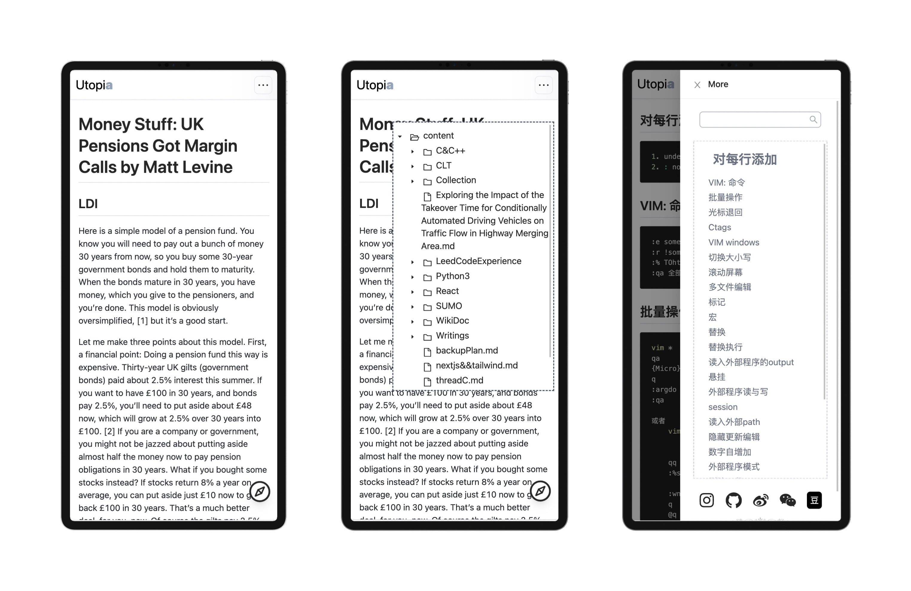
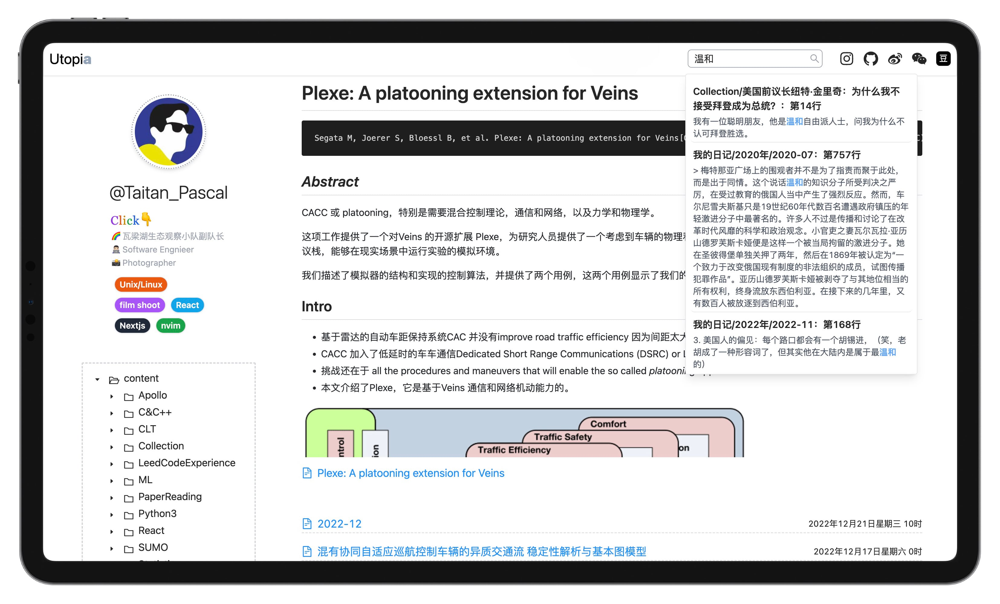

# Utopia: An environmental friendly 🌏 blog framework built with Next.js

## Key feature

* [Incremental static regeneration](https://nextjs.org/docs/basic-features/data-fetching/incremental-static-regeneration) html file: As flexible as dynamic web pages, yet efficient as static one.
* Auto compress image file using ImageOptim by running `imgUpload.sh` every time you upload images.
* Once installed, never bother to upload&Synic. Everything works automatically backside.
* Full bolg features supported: tree file classification, search, hierarchical directory……

## Development

Next.js 12.2.4 with React 18.2.0

