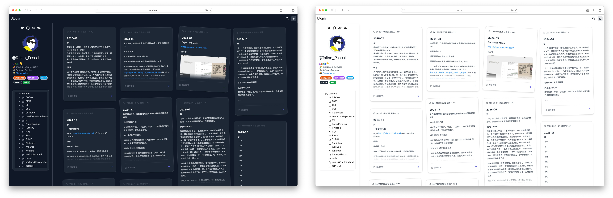
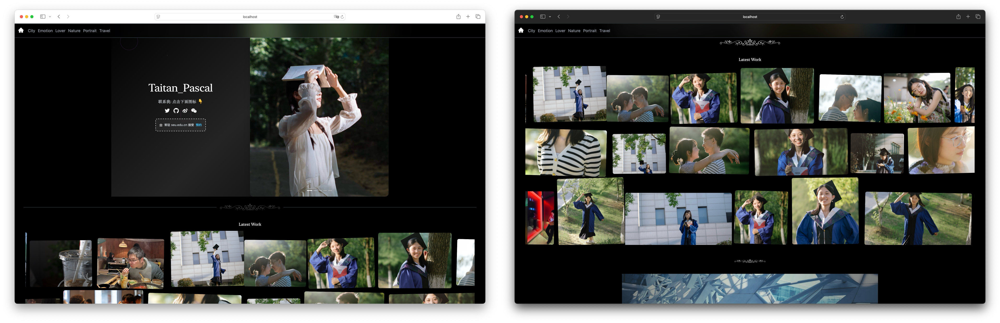
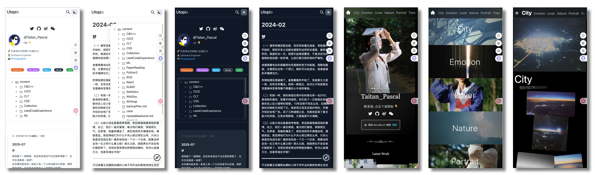
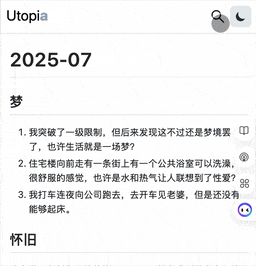
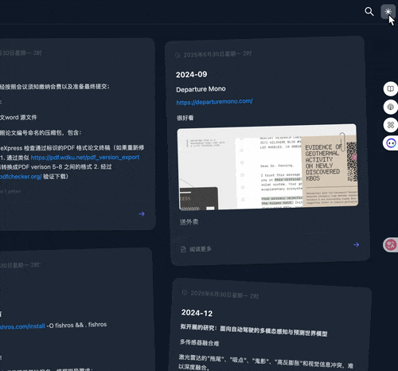
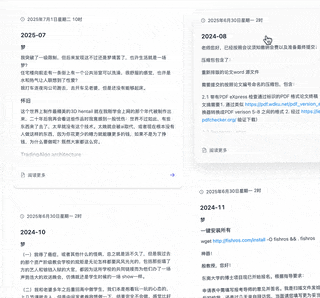
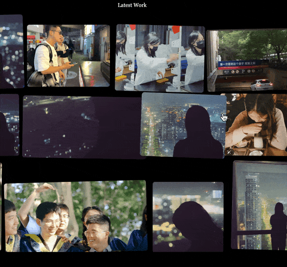

# Utopia

[](https://nextjs.org/)
[](https://reactjs.org/)
[](https://tailwindcss.com/)
[](https://opensource.org/licenses/MIT)

A personal blog and photography portfolio built with Next.js, featuring incremental content updates without full site rebuilds.

**[中文版本](./README_CN.md)** | **English**

---

<div align="center">


*Light and Dark theme interface*


*Photography portfolio with masonry layout*


*Responsive mobile experience*

</div>

## Key Features

- **Incremental Content Updates** - Add new posts without rebuilding the entire site (1-2 seconds vs 5-10 minutes)
- **File-based Content** - Write Markdown locally, upload via scripts
- **Photography Portfolio** - Auto-discover images from directories
- **Full-text Search** - Real-time search across all content
- **Dark/Light Mode** - Automatic theme switching
- **Responsive Design** - Works on desktop, tablet, and mobile

<div align="center">
  <table>
    <tr>
      <td align="center" width="50%">
        <br/>
        <sub><b>🔍 Real-time Search</b></sub>
      </td>
      <td align="center" width="50%">
        <br/>
        <sub><b>🌗 Dark/Light Mode</b></sub>
      </td>
    </tr>
    <tr>
      <td align="center" width="50%">
        <br/>
        <sub><b>✨ Animated Cards</b></sub>
      </td>
      <td align="center" width="50%">
        <br/>
        <sub><b>🖼️ Photography Wall</b></sub>
      </td>
    </tr>
  </table>
</div>


## Quick Comparison

| Feature          | Traditional Blogs           | Utopia                      |
| ---------------- | --------------------------- | --------------------------- |
| Add new post     | Rebuild entire site         | Update incrementally        |
| Publishing time  | 5-10 minutes                | 1-2 seconds                 |
| Downtime         | 30-60 seconds               | 0 seconds                   |
| Content workflow | Git commit → CI/CD → Deploy | Local write → Upload → Live |

---

## Tech Stack

- **Framework**: Next.js 15 with React 19 (pages router)
- **Styling**: Tailwind CSS + custom CSS
- **Content**: Markdown with frontmatter
- **Database**: Cloudflare D1 (SQLite) — metadata, FTS search index, page views
- **Storage**: Cloudflare R2 — full Markdown content, images
- **Compute**: Cloudflare Workers via OpenNext adapter
- **CDN**: Cloudflare Edge + R2 custom domain (`cdn.gaochengzhi.com`)
- **Build**: `opennextjs-cloudflare` → Wrangler deploy

---

## Project Structure

```
├── components/              # React components
│   ├── main/               #   Blog (FileTree, PostList, WaterfallCards)
│   ├── photo/              #   Photography (Banner, Wall, CataContainer)
│   └── util/               #   Utilities (imageUtils, treeSort)
├── lib/                     # Shared libraries
│   ├── cdnUrl.js           #   CDN URL helper (single source of truth)
│   ├── cfContext.js         #   Cloudflare D1/R2 binding helper
│   ├── auth.js             #   Authentication (HMAC tokens, cookie management)
│   └── rateLimit.js        #   Rate limiting utility
├── pages/                   # Next.js pages
│   ├── api/                #   API routes (posts, search, images, auth, photography)
│   ├── photographer/       #   Photography pages
│   ├── auth/               #   Auth pages (diary login)
│   └── [...slug].js        #   Dynamic blog routing
├── post/                    # Blog content (Markdown files, organized by category)
├── public/                  # Static assets
│   ├── .pic/               #   Blog post images
│   └── photography/        #   Photography (content/, thumb/, cata/)
├── scripts/                 # Build & deploy tools
│   ├── build-content-index.mjs   # Scan content → D1 seed SQL
│   ├── optimize-images.mjs       # Compress images + sync to R2
│   ├── sync-r2.mjs               # Sync files to R2 via S3 API
│   ├── d1-seed-remote.sh         # Upload SQL to D1 (chunked)
│   └── purge-cloudflare-cache.mjs
├── wrangler.toml            # Cloudflare Worker config (D1, R2, routes)
├── deploy.sh                # Full deployment script
├── upload.sh                # Content-only sync script
└── open-next.config.ts      # OpenNext adapter config
```

---

## Getting Started

### Prerequisites

- Node.js 16+ 
- npm or yarn

### Installation

```bash
git clone https://github.com/your-username/utopia.git
cd utopia
npm install
```

### Development

```bash
npm run dev          # Start dev server (localhost:3000)
npm run build        # Build for production
npm run start        # Start production server (localhost:8888)
npm run lint         # Run linting
```

### Content Creation

#### Blog Posts

1. Create `.md` files in `/post/` directory:

```markdown
---
title: "Your Post Title"
date: "2023-12-01"
description: "Post description"
tags: ["tag1", "tag2"]
---

# Your content here
```

2. Upload to server:

```bash
npm run upload       # Sync files to server
npm run deploy       # Full deployment with restart
```

#### Photography

1. Add images to `/public/photography/content/{category}/`
2. Run upload script - galleries auto-generate

---

## Deployment

The project deploys to **Cloudflare Workers** via `wrangler`. No traditional servers required.

### Quick Commands
```bash
./deploy.sh                # Full deploy (content + code)
./deploy.sh --code-only    # Rebuild + deploy Worker only
./deploy.sh --content-only # Sync content to R2 + D1 only
./upload.sh                # Content sync only (parallel)
```

### Deployment Scripts

| Script             | Use Case         | Features                         |
| ------------------ | ---------------- | -------------------------------- |
| `deploy.sh`        | Full deployment  | Content sync → Build → Deploy → Purge cache |
| `upload.sh`        | Content sync     | Parallel image/article/index sync |

### Environment Setup

1. Install dependencies: `npm install`
2. Configure `.env` with Cloudflare credentials (see Configuration section)
3. Ensure `wrangler` is logged in: `npx wrangler login`
4. First-time D1 setup: `npx wrangler d1 execute utopia-db --remote --file scripts/d1-schema.sql`

---

## Architecture & Data Flow

### Infrastructure Overview

The site runs entirely on Cloudflare's edge network — no traditional servers.

```
┌────────── Local Machine ──────────┐     ┌───────── Cloudflare Edge ─────────┐
│                                    │     │                                    │
│  post/             Markdown blogs  │ ──→ │  D1 (SQLite)  Metadata + FTS      │
│  public/.pic/      Blog images     │ ──→ │  R2 (S3)      Full content+images │
│  public/photography/ Photos        │ ──→ │  Worker        Next.js SSR/API    │
│                                    │     │  CDN Edge      cdn.gaochengzhi.com│
└────────────────────────────────────┘     └────────────────────────────────────┘
```

| Storage | Contents | Access |
|---------|----------|--------|
| **D1** | `posts` (metadata + preview + FTS), `photos` (index), `path_tree` (nav tree), `pageviews` | Worker API queries |
| **R2** | `post/` (full Markdown), `.pic/` (blog images), `photography/content/` (originals), `photography/thumb/` (thumbnails), `photography/cata/` (category covers) | CDN direct, or Worker fallback |
| **Worker Assets** | `.open-next/assets/` (HTML/JS/CSS, images excluded) | Cloudflare Edge |
| **Edge CDN** | `cdn.gaochengzhi.com` → R2 Public Bucket | Edge cache, 1-year TTL |

### Content Publishing Flow

```
Local Markdown   ──→ build-content-index.mjs ──→ d1-seed.sql ──→ D1 (metadata)
                  ↗
Local Markdown   ──→ sync-r2.mjs ──────────────→ R2 (full content, post/ prefix)
Local Images     ──→ optimize-images.mjs ───────→ R2 (.pic/ + photography/)
```

Key design decisions:
- **D1 stores metadata only** — `content_preview` (first 1500 chars), `content_plain` (up to 50KB for FTS). Full articles are stored in R2. This avoids D1's 100KB/row limit.
- **Image optimization is incremental** — tracks file hashes in `.image-manifest.json`, subsequent runs skip unchanged files.
- **Thumbnails generated locally** — `optimize-images.mjs` creates 400px WebP thumbnails for photography content.

### Build & Deploy Pipeline

```
deploy.sh
├── Phase 1: upload.sh (content sync, parallel tasks)
│   ├── Task A: optimize-images.mjs → compress + sync images to R2
│   ├── Task B: sync-r2.mjs --dir post → sync Markdown to R2
│   ├── Task C: build-content-index.mjs → generate d1-seed.sql
│   └── Serial: d1-seed-remote.sh → upload SQL to D1 (chunked, ~800KB per chunk)
│
├── Phase 2: cf:build (opennextjs-cloudflare → .open-next/)
├── Phase 3: wrangler deploy (Worker + Assets to Cloudflare)
└── Phase 4: purge-cloudflare-cache.mjs (purge edge cache)
```

### CI/CD (GitHub Actions)

```yaml
# .github/workflows/deploy-cloudflare.yml
CI (push/PR):     checkout → npm ci → build-content-index → cf:build  (validate only)
Deploy (manual):  checkout → npm ci → build-content-index → cf:build → wrangler deploy → purge cache
```

> **Note**: CI only validates builds. Production data (D1 content + R2 images) is always pushed from local via `deploy.sh`. GitHub Actions does NOT have R2/D1 data upload steps.

### Image Serving Architecture

```
Primary path (CDN direct, no Worker cost):
  Browser → cdn.gaochengzhi.com/photography/thumb/City/photo.webp
         → CF Edge Cache HIT → instant response
         → CF Edge Cache MISS → R2 Public Bucket → cache → response

Fallback path (Worker proxy, legacy URLs):
  Browser → /.pic/post/image.webp
         → next.config.js rewrite → /api/images/[...path]
         → CDN_URL set? → 301 redirect to cdn.gaochengzhi.com
         → CDN_URL not set? → R2.get() → arrayBuffer → response
```

Frontend components use `lib/cdnUrl.js` to convert paths to CDN URLs:
- `getCdnThumbUrl()` — photography content → thumbnail variant
- `getCdnFullUrl()` — photography content → full-size variant
- `getCdnCataThumbUrl()` — category cover images
- `handleCdnError()` — `` onError fallback to Worker rewrite path

### Image Optimization

```bash
node scripts/optimize-images.mjs              # Default: compress + sync to R2
node scripts/optimize-images.mjs --dry-run    # Preview changes
node scripts/optimize-images.mjs --no-sync    # Compress only
node scripts/optimize-images.mjs --sync-only  # Sync only
node scripts/optimize-images.mjs --force      # Force full re-processing
node scripts/optimize-images.mjs --scope blog         # Blog images only
node scripts/optimize-images.mjs --scope photography  # Photography only
```

Features:
- **Smart resizing**: Max 2560px width
- **WebP conversion**: In-place format conversion
- **Incremental**: Hash-based manifest (`.image-manifest.json`)
- **Auto-thumbnails**: 400px/70% quality for photography
- **Auto-sync**: Uploads to R2 after optimization

### Page Data Flow

#### Homepage (`pages/index.js`)
```
SSG (getStaticProps) → D1.path_tree → file tree
                     → D1.posts (LIMIT 10) → post list with previews
                     → D1.path_tree (WHERE parent='post' AND type='folder') → folder nav

Client hydration  → /api/auth/check-diary → auth state
                  → If no SSG data: /api/posts, /api/paths (fallback)
```

#### Blog Article (`pages/[...slug].js`)
```
SSG (getStaticPaths) → D1.posts (all slugs) + D1.path_tree (folders)
SSG (getStaticProps) → D1.posts (WHERE slug=?) → metadata
                     → R2.get(slug) → full Markdown → strip frontmatter → normalize image paths

Protected articles → content masked with '*' in SSG
                   → Client auth check → /api/posts/protected/[slug] → R2 → real content
```

#### Photography Index (`pages/photographer/index.js`)
```
SSG → D1.photos (LIMIT 50) → latest photos
    → D1.photos (DISTINCT category) → category list + covers

Client fallback → /api/photography/latest + /api/photography/categories
```

#### Photography Category (`pages/photographer/[slug].js`)
```
Client → /api/photography/[category] → D1.photos (WHERE category=?) → image list
```

### Search System

```
Client → /api/search?query=xxx → D1.posts_fts (FTS5 MATCH) → highlighted results
                               → Fallback: D1.posts (LIKE) → plain results
```

- Full-text search via SQLite FTS5 virtual table
- Auto-sync triggers keep FTS index updated
- Results formatted as `filepath:lineNumber:content` for SearchBar component compatibility
- Protected content is masked for unauthenticated users

### Authentication

Protected content (diary entries in `我的日记/` folder):

```
Login:   /auth/diary page → /api/auth/verify-diary → HMAC-signed cookie (7-day TTL)
Check:   /api/auth/check-diary → verify cookie → { authenticated: true/false }
Access:  /api/posts/protected/[slug] → verify cookie → R2.get() → full content
```

### R2 CDN Configuration

The R2 bucket (`utopia-images`) is publicly accessible via `cdn.gaochengzhi.com`:

- **Cache Rule**: Cache Everything, 1-year Edge TTL, 1-month Browser TTL
- **CORS**: Allows `gaochengzhi.com`, `www.gaochengzhi.com`, `localhost:3000`
- **Smart Tiered Cache**: Reduces Cache MISS rate via upper-tier data centers

URL mapping:

| R2 Key | CDN URL |
|--------|---------|
| `photography/thumb/City/photo.webp` | `https://cdn.gaochengzhi.com/photography/thumb/City/photo.webp` |
| `photography/content/City/photo.webp` | `https://cdn.gaochengzhi.com/photography/content/City/photo.webp` |
| `.pic/post/image.webp` | `https://cdn.gaochengzhi.com/.pic/post/image.webp` |
| `photography/cata/City.webp` | `https://cdn.gaochengzhi.com/photography/cata/City.webp` |

### Security

- **Middleware** (`middleware.js`): Blocks scanner probes (`.php`, `wp-admin`, etc.), malicious user agents, adds security headers
- **Path traversal protection**: All API routes validate against `..` and `//`
- **Auth tokens**: HMAC-SHA256 signed via Web Crypto API
- **Rate limiting**: Available via `lib/rateLimit.js`

---

## Configuration

### Environment Variables (`.env`)

```bash
# Cloudflare D1
D1_DATABASE_NAME=utopia-db
D1_DATABASE_ID=<your-database-id>

# Cloudflare R2
R2_ACCOUNT_ID=<your-account-id>
R2_ACCESS_KEY_ID=<your-access-key>
R2_SECRET_ACCESS_KEY=<your-secret>

# Cloudflare API (for deploy & cache purge)
CLOUDFLARE_API_TOKEN=<your-token>
CLOUDFLARE_ZONE_API_TOKEN=<zone-scoped-token>

# R2 CDN
NEXT_PUBLIC_R2_CDN_URL=https://cdn.gaochengzhi.com

# App
DIARY_PASSWORD=<your-password>
```

### Core Config Files

| File | Purpose |
|------|---------|
| `wrangler.toml` | Cloudflare Worker bindings (D1, R2, routes, vars) |
| `next.config.js` | Next.js config, image rewrites, Cloudflare dev bindings |
| `open-next.config.ts` | OpenNext adapter for Cloudflare Workers |
| `config.local.js` | Legacy local config (social links, domain) |

---

## Content Workflow

### Full Deploy (code + content)
```bash
./deploy.sh                # Everything: content sync + build + deploy
./deploy.sh --code-only    # Only rebuild and deploy Worker
./deploy.sh --content-only # Only sync content (= upload.sh)
./deploy.sh --dry-run      # Preview all changes
```

### Content-Only Update
```bash
./upload.sh                    # Sync everything (parallel)
./upload.sh --articles-only    # Markdown only
./upload.sh --images-only      # Images only
./upload.sh --skip-d1          # Skip D1 database update
./upload.sh --dry-run          # Preview changes
```

### Adding Content

#### Blog Posts

1. Create `.md` file in `post/{Category}/`:

```markdown
---
title: "Your Post Title"
date: "2024-01-01"
description: "Post description"
tags: ["tag1", "tag2"]
---

# Your content here
```

2. Upload:
```bash
./upload.sh                # Sync content to R2 + D1
./deploy.sh --content-only # Same as above
```

#### Photography

1. Add images to `public/photography/content/{Category}/`
2. Optionally add a category cover to `public/photography/cata/{Category}.webp`
3. Run `./upload.sh` — images auto-optimize, thumbnails auto-generate, galleries auto-discover

---

## Contributing

1. Fork the repository
2. Create a feature branch
3. Make your changes
4. Test locally with `npm run dev`
5. Submit a pull request

---

## License

MIT License - see [LICENSE](LICENSE) file for details.

---

Made with Next.js and ❤️