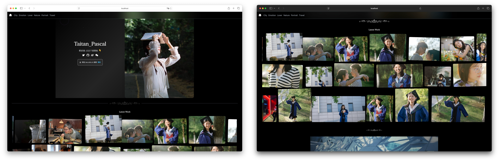
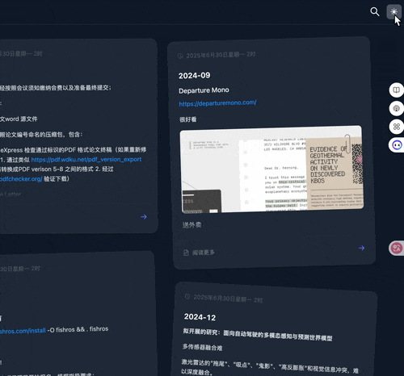

# Utopia

[](https://nextjs.org/)
[](https://reactjs.org/)
[](https://tailwindcss.com/)
[](https://opensource.org/licenses/MIT)

A personal blog and photography portfolio built with Next.js, featuring incremental content updates without full site rebuilds.

**[中文版本](./README_CN.md)** | **English**

---

<div align="center">


*Light and Dark theme interface*


*Photography portfolio with masonry layout*


*Responsive mobile experience*

</div>

## Key Features

- **Incremental Content Updates** - Add new posts without rebuilding the entire site (1-2 seconds vs 5-10 minutes)
- **File-based Content** - Write Markdown locally, upload via scripts
- **Photography Portfolio** - Auto-discover images from directories
- **Full-text Search** - Real-time search across all content
- **Dark/Light Mode** - Automatic theme switching
- **Responsive Design** - Works on desktop, tablet, and mobile

<div align="center">
  <table>
    <tr>
      <td align="center" width="50%">
        <br/>
        <sub><b>🔍 Real-time Search</b></sub>
      </td>
      <td align="center" width="50%">
        <br/>
        <sub><b>🌗 Dark/Light Mode</b></sub>
      </td>
    </tr>
    <tr>
      <td align="center" width="50%">
        <br/>
        <sub><b>✨ Animated Cards</b></sub>
      </td>
      <td align="center" width="50%">
        <br/>
        <sub><b>🖼️ Photography Wall</b></sub>
      </td>
    </tr>
  </table>
</div>


## Quick Comparison

| Feature          | Traditional Blogs           | Utopia                      |
| ---------------- | --------------------------- | --------------------------- |
| Add new post     | Rebuild entire site         | Update incrementally        |
| Publishing time  | 5-10 minutes                | 1-2 seconds                 |
| Downtime         | 30-60 seconds               | 0 seconds                   |
| Content workflow | Git commit → CI/CD → Deploy | Local write → Upload → Live |

---

## Tech Stack

- **Framework**: Next.js 12.2.4 with React 18.2.0
- **Styling**: Tailwind CSS + Ant Design
- **Content**: Markdown with frontmatter
- **Search**: Custom grep-based API
- **Images**: Built-in optimization and serving
- **Deployment**: Custom rsync-based scripts

---

## Project Structure

```
├── components/           # React components
│   ├── main/            # Blog components
│   ├── photo/           # Photography components
│   └── util/            # Utilities
├── pages/               # Next.js pages
│   ├── api/             # API routes
│   ├── photographer/    # Photography pages
│   └── [...slug].js    # Dynamic blog routing
├── post/                # Blog content (Markdown)
├── public/              # Static assets
│   ├── photography/     # Photo galleries
│   └── .pic/           # Image serving
└── styles/              # Global styles
```

---

## Getting Started

### Prerequisites

- Node.js 16+ 
- npm or yarn

### Installation

```bash
git clone https://github.com/your-username/utopia.git
cd utopia
npm install
```

### Development

```bash
npm run dev          # Start dev server (localhost:3000)
npm run build        # Build for production
npm run start        # Start production server (localhost:8888)
npm run lint         # Run linting
```

### Content Creation

#### Blog Posts

1. Create `.md` files in `/post/` directory:

```markdown
---
title: "Your Post Title"
date: "2023-12-01"
description: "Post description"
tags: ["tag1", "tag2"]
---

# Your content here
```

2. Upload to server:

```bash
npm run upload       # Sync files to server
npm run deploy       # Full deployment with restart
```

#### Photography

1. Add images to `/public/photography/content/{category}/`
2. Run upload script - galleries auto-generate

---

## Deployment

The project includes several deployment strategies:

### Quick Deploy
```bash
npm run quick-deploy    # Fast deployment for daily updates
```

### Stable Deploy  
```bash
npm run simple-deploy   # Sequential sync for unstable networks
```

### Manual Deploy
```bash
npm run upload          # Sync files only
npm run deploy          # Full deployment with server restart
```

### Deployment Scripts

| Script             | Use Case         | Features                         |
| ------------------ | ---------------- | -------------------------------- |
| `quick-deploy.sh`  | Daily updates    | One-click deployment             |
| `simple-deploy.sh` | Unstable network | Sequential sync with retries     |
| `deploy.sh`        | Full deployment  | File sync + server restart       |
| `upload.sh`        | File sync only   | Parallel upload with compression |

### Server Configuration

- **Server**: Custom VPS
- **Port**: 8888 (configured in package.json)
- **Process**: Background via `nohup`
- **Logs**: `~/web-server.log`
- **File sync**: rsync with SSH

### Environment Setup

1. Configure server details in deployment scripts:
```bash
SERVER="your-server-ip"
USER="your-username"
PATH="~/web/"
```

2. Ensure SSH key authentication is set up

3. Server requirements:
   - Node.js 16+
   - PM2 or similar process manager (optional)

---

## Image Handling

### Image Upload & Optimization

```bash
./imgUpload.sh image.jpg    # Auto-resize and optimize
```

Features:
- Auto-resize to 1080px width
- PNG optimization with pngcrush
- UUID naming to prevent conflicts
- Output to `/public/.pic/`

### Dynamic Image Serving

- **API Route**: `/api/images/[...path].js`
- **URL Pattern**: `/.pic/*` → `/api/images/*`
- **Features**: Caching, security validation, hot reload

---

## Search Functionality

- **Backend**: `/api/search` endpoint
- **Method**: Optimized grep with safety constraints
- **Features**: Real-time search, highlighted results, input sanitization
- **Performance**: Instant search across all Markdown content

---

## Photography System

- **Auto-discovery**: Scans `/public/photography/content/` directories
- **Categories**: Organized by folder structure
- **Gallery**: Responsive masonry layout with lightbox
- **Animations**: Smooth scrolling and hover effects

---

## Configuration

### Core Config Files

- `config.local.js` - Environment-specific settings
- `next.config.js` - Next.js configuration with image rewrites
- `tailwind.config.js` - Tailwind CSS customization

### Image Serving

All images are served through the built-in API route, eliminating external dependencies:

```javascript
// config.local.js
const config = {
  domain: 'your-domain.com',
  server: 'your-server-ip:5555',
  pic: '/.pic/'  // Uses Next.js API route
}
```

---

## Content Workflow

### Traditional Workflow
```bash
1. Write content
2. git add . && git commit
3. git push  
4. Wait for CI/CD (5-10 minutes)
5. Full site rebuild
6. Deploy entire site
```

### Utopia Workflow
```bash
1. Write content locally
2. ./upload.sh post/new-article.md
3. Content live in 1-2 seconds
```

---

## Contributing

1. Fork the repository
2. Create a feature branch
3. Make your changes
4. Test locally with `npm run dev`
5. Submit a pull request

---

## License

MIT License - see [LICENSE](LICENSE) file for details.

---

## Contact

- **Issues**: [GitHub Issues](https://github.com/your-username/utopia/issues)
- **Discussions**: [GitHub Discussions](https://github.com/your-username/utopia/discussions)

---

Made with Next.js and ❤️