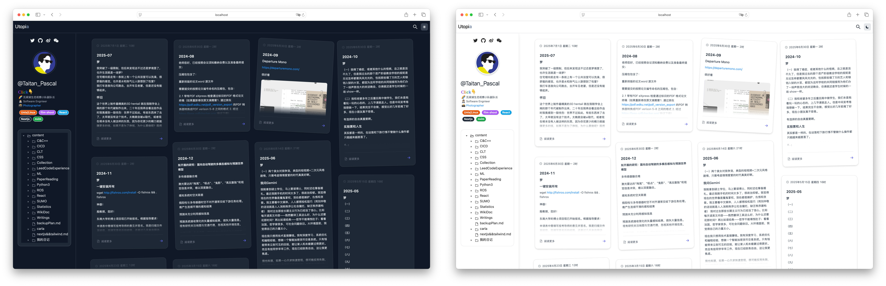
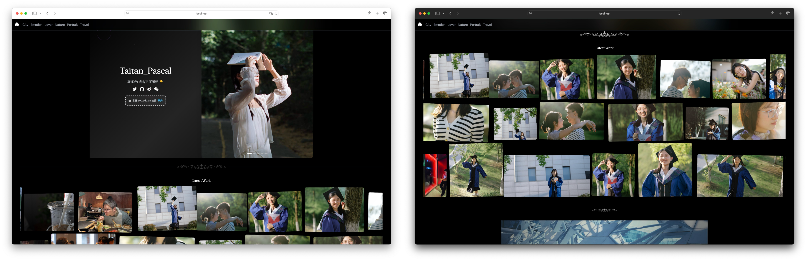
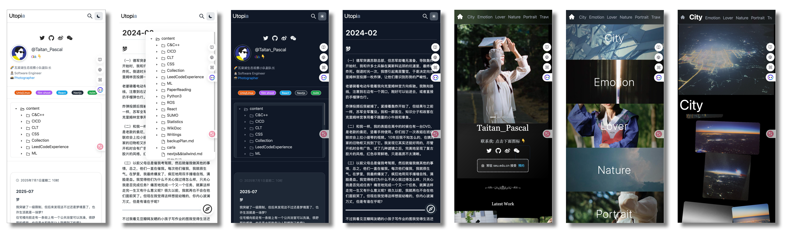
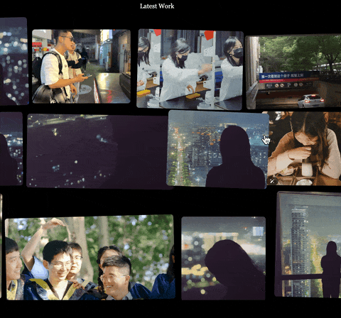

# Utopia

[](https://nextjs.org/)
[](https://reactjs.org/)
[](https://tailwindcss.com/)
[](https://opensource.org/licenses/MIT)

基于Next.js构建的个人博客和摄影作品集，支持增量内容更新，无需重构整个网站。

**中文** | **[English](./README.md)**

---

<div align="center">


*深浅主题界面展示*


*瀑布流布局的摄影作品集*


*响应式移动端体验*

</div>

## 主要特性

- **增量内容更新** - 添加新文章无需重构整个网站（1-2秒 vs 5-10分钟）
- **基于文件的内容** - 本地写Markdown，通过脚本上传
- **摄影作品集** - 自动发现目录中的图片
- **全文搜索** - 跨所有内容的实时搜索
- **深色/浅色模式** - 自动主题切换
- **响应式设计** - 支持桌面、平板和移动设备

<div align="center">
  <table>
    <tr>
      <td align="center" width="50%">
        <br/>
        <sub><b>🔍 实时搜索</b></sub>
      </td>
      <td align="center" width="50%">
        <br/>
        <sub><b>🌗 深浅主题切换</b></sub>
      </td>
    </tr>
    <tr>
      <td align="center" width="50%">
        <br/>
        <sub><b>✨ 动态卡片动画</b></sub>
      </td>
      <td align="center" width="50%">
        <br/>
        <sub><b>🖼️ 照片墙展示</b></sub>
      </td>
    </tr>
  </table>
</div>

## 快速对比

| 功能       | 传统博客               | Utopia                 |
| ---------- | ---------------------- | ---------------------- |
| 添加新文章 | 重构整个网站           | 增量更新               |
| 发布时间   | 5-10分钟               | 1-2秒                  |
| 停机时间   | 30-60秒                | 0秒                    |
| 内容流程   | Git提交 → CI/CD → 部署 | 本地写作 → 上传 → 上线 |

---

## 技术栈

- **框架**: Next.js 12.2.4 + React 18.2.0
- **样式**: Tailwind CSS + Ant Design
- **内容**: Markdown + 前置数据
- **搜索**: 基于grep的自定义API
- **图片**: 内置优化和服务
- **部署**: 基于rsync的自定义脚本

---

## 项目结构

```
├── components/           # React组件
│   ├── main/            # 博客组件
│   ├── photo/           # 摄影组件
│   └── util/            # 工具函数
├── pages/               # Next.js页面
│   ├── api/             # API路由
│   ├── photographer/    # 摄影页面
│   └── [...slug].js    # 动态博客路由
├── post/                # 博客内容（Markdown）
├── public/              # 静态资源
│   ├── photography/     # 照片画廊
│   └── .pic/           # 图片服务
└── styles/              # 全局样式
```

---

## 快速开始

### 环境要求

- Node.js 16+ 
- npm 或 yarn

### 安装

```bash
git clone https://github.com/your-username/utopia.git
cd utopia
npm install
```

### 开发

```bash
npm run dev          # 启动开发服务器 (localhost:3000)
npm run build        # 构建生产版本
npm run start        # 启动生产服务器 (localhost:8888)
npm run lint         # 运行代码检查
```

### 内容创作

#### 博客文章

1. 在 `/post/` 目录创建 `.md` 文件：

```markdown
---
title: "文章标题"
date: "2023-12-01"
description: "文章描述"
tags: ["标签1", "标签2"]
---

# 你的内容
```

2. 上传到服务器：

```bash
npm run upload       # 同步文件到服务器
npm run deploy       # 完整部署并重启
```

#### 摄影作品

1. 添加图片到 `/public/photography/content/{分类}/`
2. 运行上传脚本 - 画廊自动生成

---

## 部署

项目包含多种部署策略：

### 快速部署
```bash
npm run quick-deploy    # 日常更新的快速部署
```

### 稳定部署  
```bash
npm run simple-deploy   # 适用于不稳定网络的顺序同步
```

### 手动部署
```bash
npm run upload          # 仅同步文件
npm run deploy          # 完整部署并重启服务器
```

### 部署脚本

| 脚本               | 使用场景   | 特性                  |
| ------------------ | ---------- | --------------------- |
| `quick-deploy.sh`  | 日常更新   | 一键部署              |
| `simple-deploy.sh` | 不稳定网络 | 顺序同步，重试机制    |
| `deploy.sh`        | 完整部署   | 文件同步 + 服务器重启 |
| `upload.sh`        | 仅文件同步 | 并行上传，压缩优化    |

### 服务器配置

- **服务器**: 自定义VPS
- **端口**: 8888（在package.json中配置）
- **进程**: 通过 `nohup` 后台运行
- **日志**: `~/web-server.log`
- **文件同步**: rsync + SSH

### 环境设置

1. 在部署脚本中配置服务器信息：
```bash
SERVER="your-server-ip"
USER="your-username"
PATH="~/web/"
```

2. 确保SSH密钥认证已设置

3. 服务器要求：
   - Node.js 16+
   - PM2或类似进程管理器（可选）

---

## 图片处理

### 图片上传与优化

```bash
./imgUpload.sh image.jpg    # 自动调整大小和优化
```

功能：
- 自动调整至1080px宽度
- PNG使用pngcrush优化
- UUID命名避免冲突
- 输出到 `/public/.pic/`

### 动态图片服务

- **API路由**: `/api/images/[...path].js`
- **URL模式**: `/.pic/*` → `/api/images/*`
- **功能**: 缓存、安全验证、热重载

---

## 搜索功能

- **后端**: `/api/search` 端点
- **方法**: 带安全约束的优化grep
- **功能**: 实时搜索、高亮结果、输入清理
- **性能**: 跨所有Markdown内容的即时搜索

---

## 摄影系统

- **自动发现**: 扫描 `/public/photography/content/` 目录
- **分类**: 按文件夹结构组织
- **画廊**: 响应式瀑布流布局，支持灯箱
- **动画**: 流畅滚动和悬停效果

---

## 配置

### 核心配置文件

- `config.local.js` - 环境特定设置
- `next.config.js` - Next.js配置，包含图片重写
- `tailwind.config.js` - Tailwind CSS自定义

### 图片服务

所有图片通过内置API路由服务，消除外部依赖：

```javascript
// config.local.js
const config = {
  domain: 'your-domain.com',
  server: 'your-server-ip:5555',
  pic: '/.pic/'  // 使用Next.js API路由
}
```

---

## 内容工作流

### 传统工作流
```bash
1. 写内容
2. git add . && git commit
3. git push  
4. 等待CI/CD（5-10分钟）
5. 完整网站重构
6. 部署整个网站
```

### Utopia工作流
```bash
1. 本地写内容
2. ./upload.sh post/new-article.md
3. 内容在1-2秒内上线
```

---

## 贡献

1. Fork 仓库
2. 创建功能分支
3. 进行更改
4. 使用 `npm run dev` 本地测试
5. 提交拉取请求

---

## 许可证

MIT许可证 - 详见 [LICENSE](LICENSE) 文件。

---

## 联系

- **问题**: [GitHub Issues](https://github.com/your-username/utopia/issues)
- **讨论**: [GitHub Discussions](https://github.com/your-username/utopia/discussions)

---

使用 Next.js 和 ❤️ 制作