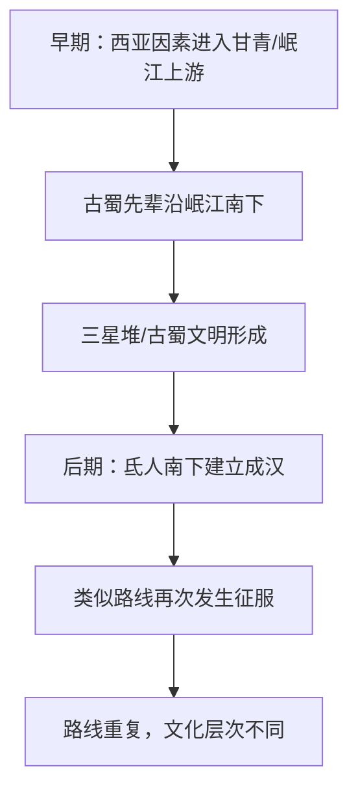
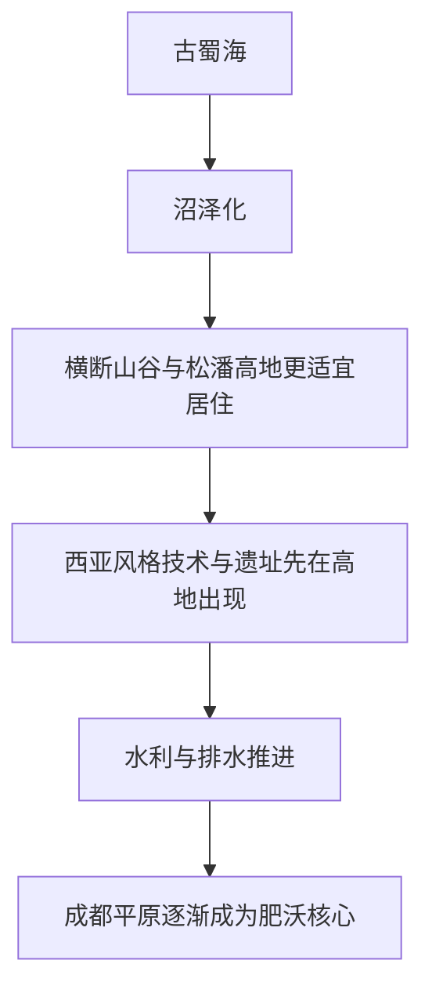

# 论三星堆

2021年3月28日，刘仲敬访谈第133期：《论三星堆》

主持人：最近三星堆出土了一些文物，吸引了大众的目光和媒体的讨论。最受瞩目的是，这次发现了一个黄金面具，面具宽23公分，高28公分。含金量约8成5，推测是祭祀用的面具。至今为止，三星堆出土的文物中比较重要的有黄金杖、青铜神树、青铜纵目面具和这次发现的黄金面具都跟我们知道的商周文明非常不同。反而跟苏美尔文化或者埃及文化有点类似。想请您说一下，您知道的三星堆文明是什么？为什么至今为止都没有发现三星堆时期的古蜀文字，这么高级的文明不太可能没有文字的流传，请您为我们解说一下。

刘仲敬：文字其实是有的，只不过大家不怎么愿意承认，而且研究的方向是错误的。其实像印章式的那种文字为数虽然不多，但是在90年代就已经发现，反复出现的符号有几十个。我觉得这个事情就是中国主义的偏见在作怪。最近出了一个新闻，有一位伟大的考古学家李维明宣称他在河南的二里头发现了文字，其中有一个数字是6。然后现场的考古队员跑出来说，对不起，这个文字是我们在考古的时候，为了整理挖出来的东西，做标记做上去的。他根本不是古人留下来的。这就说明那些考古学家做梦都想要在比殷商更早的二里头和早商文化找出夏朝传说中的痕迹，并且希望他是一个有文字的东西，所以连根本不像文字符号的东西都说成是文字。但是反过来说，有很多地方，例如赣粤的新干县大洋洲镇和吴城村这些地方的遗址，早就有文字符号出现，但是没有任何人愿意进行研究。巴蜀的印章文字不但有实物，而且有记载。直到三国时期，他还没有被汉字完全灭绝，还在祭祀当中存在，只不过在公文书写上面被汉字取代了。三国以后，相应的痕迹才渐渐消失。

| 线索     | 触发点                               | 核心问题                             |
| -------- | ------------------------------------ | ------------------------------------ |
| 器物     | 黄金面具、黄金杖、青铜神树、青铜面具 | 三星堆为何不同于商周文明？           |
| 符号     | 古蜀文字/印章式符号                  | 是否存在被忽视的文字系统？           |
| 比较对象 | 苏美尔、埃及、西亚                   | 三星堆是否可放入更大的文明传播框架？ |
| 断裂感   | 高级文明却缺少公认文字               | “没有发现”与“不愿承认”的区别         |

也就是说，在秦汉征服以后，这种文字仍然没有灭亡，而且早就有人做过分析，只不过他们在学术界地位比较低。现在的一些彝语学者说，这些文字跟文字改革以前的彝语相似，还有一些本身就是彝人的学者说，传说中的杜宇的文字记载翻译成为彝文就是神人或者祭司的意思。用彝文来解读古蜀文字根本不困难。但是大家不愿意往这个方向去走，所以现行的材料基本上被浪费掉了。按说的话，甲骨文古彝文和古蜀印章文字所代表的那些东西其实都跟苏美尔那种仓库管理员的统计符号是非常相似的。他们的同源性极其明显，像田字这些关键字的来源是很容易查清楚的。之所以没有查清楚，是大家默认了不愿意在甲骨文之前发现系统不同，而且论来源比甲骨文时间更早的文字，这就像是甲骨文跟美索布达米亚符号，最古老的楔形文字之间的关系，也没有人研究。其实按照关键字对比的话，是很容易看出两者之间的联系的，这个基本上都是导向问题。你再不适合的方向做出了研究，也不给你算学术成果，所以大家就不愿意这么做了。这其实是非常简单的事情。

这就是所谓的政治因素了，这是一种隐性的政治因素。最近出土的黄金面具不是什么新鲜东西，只是比较大就是了，他早就有了在90年代就有类似的东西。权杖在西亚尤其不是新鲜东西，圣经里面的法老都是用权杖的巴比伦国王和巴比伦以前的美索布达米亚国王都是用黄金权杖的。黄金在西亚是作为权力的象征，而且人家并不是没有青铜器。东亚文化向商周开始的那种以青铜器作为王权象征的文化，感觉就像是把西亚文化的头部贵族和祭司阶级一刀砍掉以后，剩下的中下层给人的感觉就像是陈独秀和李大钊那个由西伯利亚局建立起来的中国共产党。虽然也叫中国共产党，但是级别比苏联共产党一开始就要低一级。由马琳那些荷兰白人和欧洲白人组成的上层部分，一开始就被砍掉了。这些人在彼得和毛泽东的时代还存在。然后等到抗战时期以后，属于鲍罗亭那个阶级的人就渐渐消失了。最后才会出现现在的习近平这样的共产党，就是一个完全没有上层阶级的共产党。

| 文明象征             | 原文归纳的社会含义               | 类比方式                             |
| -------------------- | -------------------------------- | ------------------------------------ |
| 西亚黄金、权杖、面具 | 上层祭司与贵族权力的象征         | 法老、巴比伦国王、美索布达米亚王权   |
| 商周青铜、九鼎       | 更偏军事化、下层军官化的王权象征 | “把西亚文化的头部贵族和祭司阶级砍掉” |
| 三星堆黄金面具       | 保留更强的上层祭祀/殖民色彩      | 与商周形成强烈反差                   |

商周那种以青铜器和九鼎为主的王权，就像是把西亚的黄金给切掉了似的。这里面的来源很可能就是在文明向外分支的时期，建立殷商的那一支可能本身就是下层军官。因此，他们像是叛件喋血界里面逃到太平洋的那些英国叛变水手一样，一开始就是没有高级军官的，就是由下级军官和士官带领一批普通士兵，所以他的上层部分基本没有。而三星堆所代表的那种黄金面具的文明，他的殖民性质一开始就很强。其实按说的话，考古学家并没有隐瞒什么，只不过向大众介绍的媒体报道，一般不提当时的考古遗址上面出现的人种是极其混杂的，面具基本上清一色是西亚人的面孔，但是人类的骨骼就极其复杂，给人的印象就好像是殷墟出土那样，现在的各种人种的祖先都在那里。从比例上来讲的话与区域很有关系。跟文明中心的祭祀坑之类的出土的地方，那些基本上主要是西亚人特征的人种不一样，好像是平民阶级占多数的地方有大量的东南亚人口的遗骨出现，由于上层阶级留下来的遗痕，肯定在比例上是锐减的。所以古蜀文明很可能是一个英印帝国式的结构。

他的上层祭司和国王是西亚来的殖民者。就像是虽然生活在热带的岛屿上面，还是要向保姆小说中描绘的沃伯顿先生那样，每天都要打开看看两个星期以前的《泰晤士报》，看看他在永远不能再回去的英国认识的某个伯爵夫人是不是要嫁女儿了。要不要写一封3个月以后到英国的信去祝贺一下，这样营造出一种自己还生活在英国的感觉。而实际上他只是殖民地人口当中的极少数留下的骨头当中，东南亚人口就这么多的话，在实际人口当中，他们恐怕应该是占大多数的，这也可以解释，为什么以黄金为中心的这个文明，后来渐渐融化和消失了。他们应该就像是上海工部局的洋人一样。他有一个欧洲式的议会结构，但是当选的议员全是有产阶级。照现在的话说就是大资本家出身的西洋人，大部分都是盎格鲁人。而上海的大部分人口有色人种，这些极少数的西洋人在第一次世界大战以后就开始大批离开。在第二次世界大战以后，就基本上全都走光了。结果上海在第二次世界大战以后，变成一个很少白人的地方。于是工部局也就随之消失了。今天的上海已经很难看到工部局的痕迹了，但是上海能够引以为自豪的几乎所有遗产和拿得出去的高档东西都是工部局留下来的。

低级的市民文化其实是一种殖民地文化。我觉得三星堆时代的文明应该也就是这个样子的。在开明王朝以后，西亚文明因素的渐次消退，已经有一些痕迹了，差不多就是真正的都江堰水利工程在开明王朝时期基本完成以后，也就是对应伊朗文明在西亚取代美索布达米亚文明的那个阶段，它同时也产生了水利工程的进步。这个进步波及到巴蜀，就是都江堰这些工程的修建。都江堰并不是秦国修建的，而是开明王朝修建的。李冰只是一个神话人物而已。以后渐渐就要进入一个走下坡路的阶段，这很可能是因为内亚通道的断绝。顺便说一句，坚持三星堆文明为西来的理论当中，有很多人坚持是西南通道，就是印度东南亚通道。这一点我是很不赞成的。比如说黄金面具的纵目在现代是留有痕迹的。它就是氐羌人口的特征。氐人对纵目的爱好一直延续到近代，近代的人类学家和民族学家都知道，纵目的神话传说是存在于四川盆地西北部边缘岷江上游的氐羌人口当中，而不是存在于巴蜀南部滇蜀边境和张骞所谓的蜀身毒道，从印度东南亚通向四川盆地的那些滇属人口当中。

照史记和汉书的记载，巴蜀被秦汉灭亡以后，残余的王子向南方逃窜。他们到汉武帝时代仍然自称为古蜀王朝的子孙。而越南史学家也说，巴蜀王子在亡国以后逃到了越南北部建立了古螺城，利用他的巫术力量对当地土著进行直接统治后来这个王朝被南越武帝的干涉军推翻了。这两方面记载都说明，亡国以后的贵族阶级是向南方逃窜的。这个逻辑就像是希克索斯人征服埃及以后，埃及的王子逃到努比亚。努比亚不是埃及，但是跟埃及关系密切，在埃及强盛的时候，往往会变成埃及藩属的尼罗河上游的黑人国家。跟皮肤偏白的埃及人在人种上不一样。但是身受埃及文化影响。所以埃及在本土被攻占以后，上层阶级就逃到努比亚去避难，然后从上尼罗河反攻，最终光复了尼罗河流域。虽然古蜀的贵族阶级没有光复，但是他们也是往南方边境逃的，他们在亡国时期外逃，在南方边境留下痕迹，不能解释成为开国时候的征服者也是从南方边境来的。征服者按照常规，他们在自己的来源地还留有一些痕迹。在平原地区的大国灭亡以后，在早期原住民居住的山地应该留有一些痕迹。

| 路线假说                         | 原文态度       | 关键理由                                           |
| -------------------------------- | -------------- | -------------------------------------------------- |
| 西南通道：印度—东南亚—滇蜀       | 不赞成         | 纵目、低羌传统不在滇蜀边境与印度东北部留下核心痕迹 |
| 西北通道：甘青—岷江上游—四川盆地 | 倾向支持       | 岷江上游低羌人口、割基人传说、纵目与石棺传统更吻合 |
| 亡国后南逃                       | 可解释南方痕迹 | 贵族南逃不能反推开国征服者也来自南方               |

而这些痕迹很明显就是氐羌民族在近代留下来的那些割基人的传说。割基人很可能就是古代氐人，他们一样是用大石头的棺材铸造纵木面具。纵目是一个非常明显的特征，在其他地方都没有，只有在岷山上游高地的氐人才有。而在滇属边境和印度东北部是找不出这种痕迹来的。合理的推论就是古蜀的先辈是从岷江上游来的。而且历史往往是不断重复的。像蒂什塔尔和公牛这些神话传说，根据现代历史学家和神话学家的考证，最后变成二郎神崇拜和氐人李特成汉帝国的战神崇拜。他们也是在今天陕西南部跟青海交界的岷江上游白龙江一带的氐人当中首先传播的。我们都知道，第一人在所谓的五湖乱华时期和永嘉之乱时期，沿着岷江河谷南下进入盆地，打败了西晋派来的刺史罗上建立了成汉帝国，这个路线很可能就是在重复三星堆人祖先，沿着岷江河谷南下的路线，又一次重演了征服。

陈寅恪说，成汉帝国是一个天师道的帝国，而他们的祖先信奉雨神蒂什塔尔之类的，这些都是伊朗文化的特征。这一次，他们传来的西亚文化已经是伊朗文化了，而三星堆时代传来的文化，还是伊朗文化取代旧文化以前的早期美索布达米亚文化。但是传播方向是一样的，他们走的是同一个路线，导致秦国灭蜀的开明王朝时期传播路线的中断，大概就是由于秦孝公和商鞅变法以后，秦人开拓西域俘虏了义渠这些西戎的大臣，把义渠国变成了秦国的藩属。这样一来，就把汉水、白龙江、岷江通过凉州的走廊和青海道跟西方的联系通道给切断了。汉中这条通道对楚国非常重要，因为楚国的火神崇拜，也是从西亚来的。张仪和楚怀王那个时代，秦人开拓汉中关闭西荣，楚国被孤立在东南亚，因此以后楚国的铁器技术也就渐渐不能更新了。这个做法就好像是日本在二战时期把上海的航运切断了。上海的生命线就在于他跟欧洲的航运，切断了这条生命线，极少数的白人人口就无法维持上海的近代化了。渐渐上海就退化，成为一个东亚城市了。同样，秦国在切断了汉中走廊以后，楚国就退化成一个东南亚国家，渐渐就没有办法抵抗秦国的进攻了。

秦人在切断内亚走廊以后，开明王朝也就失去了伊朗专家的支持，军事上也就渐渐退化，不能再抵抗秦国的进攻了，这两者跟诸葛亮北伐时期依托凉州那些小酋长的做法相同。照《前后出师表》的说法，他有几十个这样的小酋长，所谓的凉州各国王给他助战，也依靠姜维的凉州兵为他打开通道，来跟司马懿和郭槐作战，目的也就是为了保持这个通道。所谓的五胡乱华当中的氐人南下，其实就是费拉化的平原人，又一次被不费拉化，保持蛮族传统的高地人征服。氐人的风俗代表古蜀人的风俗，而平原人的风俗代表蜀人汉化。汉化和费拉化以后的编户齐民风格，反倒不是蜀人的原始风格。这样解释才能把整个逻辑连通起来。古代历史上的大沼泽地不是一个沼泽地，而是跟中古时期的青海道一样，是一个遗址颇多的地方。最古老的遗址在松潘高原草地是非常之多的，而现在基本上是一个不能住人的地方，说明当时的气候条件跟现在不一样，横断山谷的半坡上海拔很高的地方有大量的人类遗址，而四川盆地本身几乎没有。这里面的原因在哪里，就是因为在旧石器时代以前的远古时代，巴蜀是一片海洋，然后变成一片沼泽。

这就是古生物学家所谓的古蜀海。当时的海生生物是在成都平原低地大量出土的。当时的三峡地区的长江是一条向西流动的河流，把河水注入古蜀海。当时的横断山谷的高地，可能正是气候适宜的平原，而松潘高原和沼泽，当时正好就是气候最合适的平原，最古老的有西亚风格的包括冶炼业技术的考古遗址是大量在这些地方出现的，然后才逐步进入四川盆地。可以想象，四川盆地首先是海洋，然后随着地势的改变，渐渐变成沼泽地。这个沼泽地跟印度大多数地区，包括印度和下游，几乎全部的恒河流域和南印度海岸以及美索布达米亚南部，就是幼发拉底河和底格里斯河入海地区那个错综复杂的三角州沼泽地区，相比气候应该是极为相似的。最初居住在这些沼泽地的人口，应该是从东非到美索布达米亚南部沼泽地，然后沿着印度东南亚海岸、一路北上的东南亚居民。他们开发出来的水稻古蜀文明也是有水稻遗址的之类的东西，大概是印度东南亚一线适应亚热带气候和沼泽气候的作物，跟美索布达米亚南部的椰枣一样。水稻应该是起源于印度，然后向东南亚和向北逐步扩展。

水稻跟文明的关系不明确，原始的野生水稻可以跟没有国家形态和文明的部落组织相配伍，也就是说水稻并不导致文明的产生。但是小麦和面包直接导致了文明的产生。小麦和面包是在耶利哥和叙利亚高地首先产生的，而不是在美索布达米亚平原。最早的美索布达米亚文明就是现在通常所谓的苏美尔文明，他们的语言文字有很多叠音字。有些考古学家认为，这些叠音字其实代表了美索布达米亚南部被征服的沼泽地居民原来的语言。这些叠音字在从印度到东南亚的包括百越各民族人口的残语语言当中仍然有痕迹，很可能就是这一带的亚热带居民一路带过来的文字。美索布达米亚正式的文字，楔形文字吸收了这些因素作为底层，但是它本身包括了很明显是仓库管理员和高级文明的一些特征。所以合理的推论就是最早的美索布达米亚文明也不是单元的，它应该是在叙利亚高地上驯化了小麦，在高地的神庙当中就已经出现了一些祭祀符号和仓储管理系统的高地文明在进入低地排干沼泽，使人口和资源大量增长以后形成的新文明。原来的野蛮的沼泽地居民没有文明，但是有稻米和其他沼泽地物种在吉尔伽美什史诗和美索布达米亚祭祀的传奇当中留下了一点点痕迹。像大英雄吉尔伽美什和恩奇度出征的时候，就曾经杀掉了森林之神胡姆巴巴。森林之神胡姆巴巴是一个可怕的妖魔，住在黑黝黝的充满了森林和沼泽的野蛮地区。吉尔伽美什为了修建神庙，要他提供资源和劳役，这就是征服者的口气了。你要为我服务。胡姆巴巴以他野蛮的方式坚决拒绝了。双方打了一仗，最后，胡姆巴巴被俘，要求饶命，愿意做藩属，把资源贡献给吉尔伽美什。吉尔伽美什一度想饶了他，但是吉尔伽美什的伙伴恩奇都坚持说，胡姆巴巴必须杀，于是胡姆巴巴就被杀掉了。这个故事应该跟古世界里面天孙民族天照大神的子孙和大国主神的战争非常相似。照那些神话，大国主神才是日本的原住民。天孙民族从高天原下来以后，大国主神最初是看他们不顺眼的，也是打了一仗。然后大国主神被征服了。

这个很可能就反映出了弥生民族征服今天虾夷人的祖先。弥生民族要么像江上波夫所说的那样，可能是从亚洲大陆来的，有一些更先进的技术，要么可能就是日本西部吸收了外来资源和技术的一些族群和政治团体，征服了东部比较孤立的那些虾夷人的祖先，导致了日本国家形态的产生，征服产生国家，这基本上是世界历史上的通例。国家本质上是军事组织的产物。而原始部落很可能是没有军事传统的，打打架打败的人就跑掉，很难形成稳固的征服者结构。国家很可能就是对跑不掉又不能杀光的原住民实施殖民统治才建立起来的东西。也就是说，本来是临时性的军事组织以后要建立常设性的军事组织，然后才会产生文明。

| 要素       | 原文中的定位                       | 是否直接生成国家/文明  |
| ---------- | ---------------------------------- | ---------------------- |
| 水稻       | 亚热带沼泽地原住民作物             | 不必然导致国家形态     |
| 小麦与面包 | 叙利亚高地、神庙仓储体系相关       | 更直接推动文明组织形成 |
| 沼泽资源   | 可养活原始居民与部落               | 需要外来组织力量整合   |
| 神庙仓库   | 祭祀、统计、土地丈量、资源分配中心 | 文明组织者             |

美索布达米亚文明当中留下来的这些神话就显示出人数不多，但是拥有比较高级的宗教技术和组织能力的这些征服者征服了不知道人数有多少，但是至少也有一些生存能力，农作物和相当多资源的沼泽地居民。这很可能就是在叙利亚高地，产生了小麦啤酒和神庙祭司仓库的这些苏美尔人的真正祖先，在进入美索布达米亚沼泽以后，对没有能力开发沼泽，像青蛙一样居住在沼泽地上，利用沼泽地的生物过比较原始生活的原住民的征服。他们的文明形态以神庙为中心。照美索布达米亚大洪水的传说，洪水以后，所有地方都被淹没了。神庙的祭祀下去以后，以神庙为中心进行组织重新丈量和划分土地重建城市，像乌鲁克这样的城市都有洪水以后重建的记录，大量烧制砖瓦建设城市。

现代的考古遗址也证明他们有大量的砖瓦烧制厂。砖瓦上刻的可能最初是为建筑所标志的符号，也变成了楔形文字的一个来源。这就说明神庙的功能比现代的神庙要多得多，而且是文明的组织者。美索布达米亚早期王这个词有两个来源，恩西和卢加尔，一个是相当于城市共和主义的富豪统治的长老来源，一个是神庙的祭祀来源。所以美索布达米亚的王权系统也有两个，一个是由祭祀演化而来的王权。一个是由建立共和式的长老式统治的大长老建立起来的王权。他们在美索布达米亚语言中留下的痕迹也不一样。这就是美索布达米亚文明向外扩张的基本模式。印度河的文明产生的时间稍晚，但肯定是美索布达米亚文明的分支。迪尔蒙的传说和记录中提到，早期美索布达米亚文明进口的很多东西是从印度河口用船只沿着波斯湾运来的。印度河口的文明比如说哈拉帕文明，他们的风格是典型的美索布达米亚式的，就有人认为三星堆文明是从哈拉帕文明过去的。但是我认为他与其说是从哈拉帕文明过去的，不如说它跟哈拉帕文明一样，就像是香港和上海的关系。

香港和上海都是英国殖民主义的产物，但是上海并不是香港殖民的产物，三星堆也不是印度和殖民的产物，上海只是比香港稍晚一点被英国人殖民，这样在逻辑上才通，而且殖民的路线并不是从西南以印度、缅甸这条路线过去的，而是从西北的甘青走廊一带进入保墩文化的，就是三星堆以前刚刚从沼泽地退去的岷江河谷西北部的这些地方，古蜀的首都是不断向南迁徙的最初的中心是在山地下面。这个逻辑跟北京市蒙古人的中心一样。北京城是最接近于草原的城市。阿拉伯人征服以后，也在美索布达米亚的沙漠边缘建立库法城，库法城就是一个沙漠港口，北京城就是一个内亚港口。而随着文明的逐渐开拓，首都不断向南，首先移到绵阳，然后才移到成都。合乎逻辑的推断就是最初的时候，成都还是一片沼泽地根本没法住人。随着人口的增加和排水技术的进步，原来的沼泽地渐渐开拓，变成最肥沃的平原，所以首都才会像魏孝文帝迁都一样，从平城迁到洛阳。平城市内亚的港口，而洛阳是东亚大平原的中心。成都是四川盆地的中心，绵阳则是一个比较边缘的地方。

首都从绵阳向成都方向的迁移，就像是北魏鲜卑人，从平城向洛阳的迁移一样，反映了征服者逐渐被平原人同化。同时，随着水利技术的开拓，人口和经济中心向南方扩张，稻米是典型的跟文明没有关系的亚热带沼泽地原住民的产物。在黄金面具和西亚风格的文明出现以前，古蜀海的沼泽地退去以后，考古证据已经显示有使用稻米的跟百越人口很相似的东南亚人口在成都平原居住了，但是他们没有国家形态。三星堆的黄金面具文明像是拔地而起，从天上掉下来的。就像是工部局的上海一样，他在大清国的松江县找不出先例来，但是在大英帝国的香港和印度却可以找出先例来。跟三星堆相对应的传说，民俗和考古遗址是从甘清地带到岷江山谷一带分布的，就像是上海的考古遗址和民俗是在加尔各达和香港之间一样。这里面显示的逻辑非常清楚。三星堆文明像他的元祖美索布达米亚文明一样，是殖民者和被殖民者混合的文明，而且比例有所不同。在美索布达米亚，来自叙利亚高地的文明主体，在人口上很可能是占多数的。沼泽地后来虽然变成平原和农田以后可以养活大量人口，但是在文明人殖民以前可能只能养活极少量的逐水而居，像青蛙一样的原始居民。

总之，他们占的比例应该是没有像远东的殖民地那样大，所以留下的痕迹也很少，只在语言当中留下一些叠音字hamumbabab就是一个典型的叠音字，但是在印度情况又可能不一样，可能原住民就占多数了。在三星堆，原住民肯定是占压倒多数，而他们在上层阶级当中占的比例却很低。上层阶级的人口也是混杂的来源各不相同，很像是统治英印帝国的欧洲公务员系统。英国人在这里面其实是占少数的英印帝国的公务员和上层阶级。包括了来自于全欧洲的人口，而莫卧儿帝国的上层阶级，包括了来自于伊朗河中地区和穆斯林世界的人口。印度本土人也很少。莫卧儿帝国和英印帝国的上层阶级，都是混杂了外来人口。三星堆的上层阶级好像也是他们之间的关系并不是专制性的，而是长老式的，所以国王应该只是祭司群体的领袖。90年代，在三星堆遗址曾经发现过十几个大长老性质的面具，好像在祭司当中也是共和性质的。我们当作国王的东西，应该只是祭司共和传统。这些大长老很可能代表不同的城市。每一个城市有一个大长老有比较小的大立人，而中间有一个最大的立人，可能就代表着领袖城市。

像荷马史诗中阿加门农王那样的领袖祭司国王，他并不是独裁统治者，他只是代表最强盛、威望最高的城邦像苏美尔史诗中描绘的那样，曾经有一度洪水以后王权在基石。基石并没有像汉穆拉比国王那样的专制统治者，他是苏美尔几百个城邦当中的领袖国家，有齐桓公和晋文公那样的君主。准确的说，不是君主，而是霸主，因为很多城市是共和国。威望最高的城邦享有荣誉领袖的称号，但是其他城邦的领袖并不是他的奴仆和下属。三星堆的那十几个立人，规模比较小的立人，应该就是这些次要城邦的领袖祭司，而最大的那个立人应该就是像王权在基石那样的领袖城邦的立人。这个解释是巴蜀本地学者段渝提出来了，他也是坚决主张黄金面具和青铜在巴蜀都有。但是黄金面具是远东其他地方所没有的。所以，巴蜀文明应该不是远东文明。但是他在中国考古学界的地位就比较低。他提出的学说也不能得到官方的接受。这个学说是1990年就有的，应该解释成为三星堆的文明也是一个城邦联盟。那些比较小的威望不大高的城邦，就像齐桓公和晋文公会盟时期的郑国和蔡国这些小国一样，他们愿意接受齐桓公的领导，但是他们并不是齐桓公的下属。

所以他们的造像在遗址中间发现，就比领袖城邦的祭司的造像要小一格显示他们是盟员，而不是盟主，但是这些神像众星捧月的结果是放在一起的，说明他们基本上还是委员会主席和委员的那种关系。这个关系跟苏美尔文明黄金时代乌鲁克城邦基什城邦乌尔城邦争霸的局面也是一样的。其实是最早的霸权城邦，然后霸权一度移到乌鲁克，最后移到了亚伯拉罕的乌尔，这也是齐桓公和晋文公诸侯争霸的基本格局，同样的文明产生出了同样的结果。古老的巴蜀文明，应该就是这些殖民者把拥有水稻和东南亚沼泽地作物的不同居民，通过水利开发和神庙建设组织起来的结果。三星堆的文明比殷商的文明更早，而且更高级，有很多证据包括他们的城市结构。现在，乌鲁克城和美索布达米亚的城市结构已经研究的比较清楚了。今天，伊拉克地方的文明应该大体上可以分为三段，以乌鲁克为代表的早期美索布达米亚文明，以亚伯拉罕的乌尔为代表的晚期美索布达米亚文明，雅利安人征服以后的伊朗文明，这是三个不同阶段。雅利安征服起的作用好像就是日耳曼人入侵欧洲的那种作用，把晚期已经趋于专制化、编户齐民化、土壤退化、文明退化的文明重新启动了一下，跟很多进步主义者的想法相反。

| 结构角色        | 原文中的对应物 | 政治含义                 |
| --------------- | -------------- | ------------------------ |
| 最大立人/大祭司 | 领袖城邦代表   | 类似“王权在基石”的盟主   |
| 较小立人/祭司   | 次要城邦代表   | 盟员，而非奴仆或下属     |
| 城邦联盟        | 众星捧月式摆放 | 委员会主席与委员的关系   |
| 祭司共和传统    | 非绝对专制     | 更接近早期苏美尔城邦秩序 |

早期美索布达米亚文明在有些方面比晚期美索布达米亚文明给人留下的印象要好。他不那么尚武，缺乏军国主义风格。圣经当中，巴比伦人和亚述人进行过可怕的征战。例如，用纵火队焚烧耶路撒冷城墙，把比远东的任何城墙都要厚得多的，自身就像一座城市一样厚的石头做成的耶路撒冷城墙在烈焰中烧得炸裂开来。近代的以色列考古学家发现，城外几百里的橄榄树林都被砍光了。橄榄树本来是作为重要的经济作物和国家财宝而保护下来的，希腊人就主张战争是可以的，但是在战争时期砍伐橄榄树是不可饶恕的战争罪。而橄榄树被巴比伦王的专职纵火队员全部砍下来，堆在城下，一把火烧裂了耶路撒冷城墙，这种可怕的军国主义战争，在早期美索布达米亚文明还不存在，早期美索布达米亚人的城市的城墙是祭祀台，它的坡度极其平缓，平缓到从城外老太婆都可以爬上来的那个地步。但是城墙上的平台极其宽广而壮丽，跟这个极其相似的平台在巴蜀平原已经发现了相应的残余，没有问题，它是一个梯形的斜坡，他完全没有防御职能。但是作为祭祀和表演的舞台是极其合适的。

可以想象。当时的城邦盟主，他们也是最早的天文学家，计算黄道吉日，在太阳、星星和各种光照最合适的时候，在这样的城墙高台上举行仪式。对于那些被征服的土著民众和崇拜祭司领袖的盟邦小国来说的话，这样豪华壮丽的宗教仪式，一定是孔子所谓的远人不服，则秀文德以来之，让大家心悦诚服。他们可能像印第安人的夸富宴一样，酋长不怎么需要打仗。行宴会在宴会上把自己拿来的各种宝器向邻近部落的酋长和广大民众炫耀一番。为了表示我有多富，甚至要扔掉、砸掉、烧掉一些宝器。其他酋长自惭形秽，我们部落就拿不出这么多宝器扔掉或者砸掉，我服了，你就是盟主了。举行这样一个夸付宴就确定了国际关系。在乌鲁克的城墙和三星堆的城墙上举行这些宗教仪式，大概具有。同样的意义，我们要注意，有些祭祀坑里面的青铜宝器是烧掉或者砸掉的，可能也有类似的含义。

这样的国际关系和政治统治方式是比较文明的。他不怎么需要杀人。原始土著民族看到英国人盖起的洋房顿时就跪下屈服了，根本不用打仗，而领袖城邦跟其他城邦的关系也主要依靠祭司修文德的结果。因此，这样的城市在晚期美索布达米亚的兵车产生以后，可以说是不堪一击的，很容易就被打倒了。而乌尔城邦和征服了乌尔统一美索布达米亚的巴比伦人。迦勒底人和北方的亚述人之间的征战，那就是高度专业化的专业化的战车兵团投石兵团诸如此类的。这样的城墙不堪一击。而新的城墙变成了有防御的城墙。我们要注意，这个城墙跟殷商的城墙是很相似的。他是准备好相应的坡道和轨道的秦始皇要车同轨，像现在的铁路一样。如果轨迹不同，很容易翻车，事先就在城墙里面准备了战车道，是在准备防守反击的时候，为了城里人的战车从城门迅速的冲出去，打垮敌方阵营而设立的。同时城墙也变得极其陡峭而高峻。不要说是老太婆了，连武士都爬不上来。这就是准备在我们的城市一旦被人围攻的时候，这个城墙要守得住祭祀的功能退居幕后，战争的功能居于压倒优势。殷商所代表的文明跟亚伯拉罕的沃尔以后的晚期美索布达米亚文明和取代美索布达米亚文明的军国主义诸帝国非常相似，他们是战争国家，而殷商是一个吃人的国家。甲骨文反复记载，被俘虏来的人，包括方伯和酋长之类的，他们的人头被放到锅里面煮，像现代人吃火锅那样，是实实在在拿来吃掉的，冷酷无情的当作一种资源来运用，把所有的东西，包括活人当作资源来运用。顺便说一句，美索布达米亚早期文明是没有人祭这回事的。乌尔开始的晚期文明出现了活人祭祀，现代的考古学家已经发现了这一点。但是活人祭祀并不是杀俘虏，而是上层人士和贵族，包括贵族妇女，在国王或者领袖去世的时候从容不迫的自愿殉葬。有些考古学家推论，他们可能服了一些像大麻或者埃及蓝睡莲这样的致幻剂，在幻觉当中觉得他们要追随他们的领袖进天堂。

| 城墙类型       | 功能重心             | 对应文明气质                      |
| -------------- | -------------------- | --------------------------------- |
| 缓坡高台式城墙 | 祭祀、表演、威望展示 | 早期美索布达米亚/三星堆式祭司文明 |
| 陡峭防御式城墙 | 守城、反击、战车通道 | 晚期美索布达米亚/殷商式战争国家   |
| 从高台到堡垒   | 仪式政治转向军事动员 | 文明竞争进入更残酷阶段            |

有一个女孩子大概也是宫廷妇女，还临时把她的糖果之类的东西装进了口袋，衣服整整齐齐，绝对不像是受强迫的样子，也没有俘虏被杀的痕迹。到了远东的殷商就变成大规模的。数以千计的俘虏在祭祀中被杀，杀掉以后，骨头送到工厂去做成碗或者其他什么手工业用具，肉就直截了当的跟牛肉和羊肉一起吃掉。国王死后自愿献身的祭祀不见得没有，但是数量肯定居于下风。这就是没有把被征服者当作人，而是把被征服者当成牛羊一样的野生动物来处理。畋猎的意思就是烧一把火把野田里面的野生动植物。烧掉，同时把被火赶出来的野生动物作为狩猎对象，在开垦田地之前，先痛痛快快打一次猎，吃很多肉。被赶出来的那些野生动物，不仅是野牛和野羊之类的动物，还有大量的野人。商朝的投石器和箭矢之类的东西，都是为了在逃跑的野人腿上射一箭或者缠住他们的腿，然后把他们拖回来吃掉而设计的。就像是《叛舰喋血记》的水手到了野蛮的不得了、跟他们的文明没有办法比的住泥土房屋的地方，而他们自己的资源又极其匮乏，于是就发明了一种阿兹特克式的理论，就是说这些土著居民，只是野生动物，不是跟我们一样，但文明程度较低的原始人，而根本上就是野生动物，抓来吃跟吃野味一样，没有什么区别。

这样的特点，在三星堆没有显示。三星堆没有这样的军事化的城墙或者战车也没有吃人习俗的记录。它代表的是乌鲁克那个时代的早期美索布达米亚文明，它是祭祀国王的文明。而晚期美索布达米亚是军人国王的文明，在有马镫的马被乌克兰和欧亚大草原的游牧民族发明以前，战车像坦克一样无敌，后来战马骑兵产生以后才被骑兵所取代。战车文明是晚期美索布达米亚文明和殷商文明的体现，它代表的就是向圣经当中撒母耳谴责以色列人那样，以色列人为什么要立一个国王？以色列人原先也是只有祭司国王的，就是圣经里面的士师。士师是主持祭祀的宗教领袖以及判案的法官和习惯法主持者，他不怎么会打仗。以色列人说，我们老打败仗？为什么因为别人都有可以调动一切资源的军人国王，而我们以色列人没有国王。于是他们就向撒母耳要求：我们也要有自己的国王。撒母耳愤怒的对他们说，有了国王以后，国王会虐待你们，这是你们自作自受的。但是以色列人还是要国王，后来果然出现了三宫六院的所罗门国王。所罗门还有一些功业，而他的后代就是没有功业，只有虐待了，完全应验了撒母耳的预言。

撒母耳代表的就是工部局时代，第一次世界大战时期的老绅士看到第二次世界大战时期的集权国家崛起以后，向外交大臣格雷一样含泪说道，欧洲的灯火熄灭了，我不会活着看到灯火重新明亮起来的那一天。1989年萨拉热窝的枪声，像1914年一样再次响起的时候，老欧洲人密特朗就想到去访问萨拉热窝。密特朗总统是一个记得救欧洲的欧洲人，他知道欧洲文明永远没有恢复到1914年以前的状态。我们不能认为原子弹和手机的技术比19世纪先进。20世纪就比19世纪文明，19世纪不需要护照，你只要有钱就能80天环游地球。如果警察怀疑你是罪犯，你拿了一封私人信件，就可以让警察道歉。今天最文明、最民主、最自由的美国没有这种事情，你不可能在美国不使用护照的。护照的使用就是20世纪文明堕落的一个标志。晚期美索布达米亚文明和早期美索布达米亚文明之间的关系也是这样的，军人国王取代了祭司国王残酷的毁灭文明，砍倒橄榄树，把战败的城邦，不仅在政治上征服，甚至毁掉他的水利设施，恶意的把他的田地变成一片盐碱队，让他变成无法生存，无法延续文明的荒漠地带。

这种野蛮的战争手段，在早期美索布达米亚文明是不可想象的。伊拉克的衰落也跟战争形式的升级有关，就像是。绞肉机式的战争在第一次世界大战以前是不可想象的那样。第一次世界大战初期，德国军队在比利时烧了一座中世纪的图书馆。鲁汶大学图书馆，茨威格、罗曼·罗兰和欧洲的知识分子立刻勃然大怒，把德国人当作野蛮人来痛骂一座图书馆算个屁，德国军队在比利时枪毙了一个被怀疑为间谍的护士，英国报纸又要大发雷霆，为什么会有这样野蛮的人。二战时期，上百万的平民由于怀疑他们的族群可能同情敌国，而直截了当的被强制迁移，再也没有人放个屁，大家都习以为常了。斗争升级以后发展到毁灭文明本身的地步，这就是博弈固有的结果。

三星堆和殷商没有直接关系，没有证据证明他们有过直接交涉。但是三星堆所代表的显然是那种气氛比较舒缓的早期美索布达米亚文明，而他由于地理上的缘故跟商周那种战车文明开始没有接触。接触以后，在开明王朝时期，他也慢慢的开始被动使用战车了。我们可以发现他的战车的圆盾是苏美尔盾，而不是亚述盾。亚述盾是方盾，他的屏蔽能力比较强，适应了更加残酷的军事形式。在专业的弓箭手万箭齐发的时候，方盾能够很好的保护盾手。而方盾可以结阵，一大批使用方盾的士兵跪下来，把方盾排成一排，可以形成一个盾牌阵，就像是一个临时的城堡一样，很难摧毁。而到了开明王朝时期的巴蜀，使用的仍然是早期苏美尔的那种圆盾。考古学遗址显示，圆盾就是胸前这样小小的一片。如果万箭如雨，这个圆盾根本保护不了你。他适应的是早期比较绅士化的战争。圆盾使用者的下半身完全是暴露的，可以想象，他的使用者是君子，就是印度古代史诗对于阿周那和那些英雄所描述的那样高贵的绅士打仗的时候不攻击敌人的下半身，打了敌人的下半身，赢了也不光彩。

这种绅士化的伦理，就像第一次世界大战以前的战争伦理，在更残酷的战争来临的时候，在自己的本部都已经被摧毁了。坚持使用小圆盾的开明王朝，最终被装备了亚述式武器的秦国残酷无情的征服。这个故事早在凡尔登的欧洲和美索布达米亚本土早已发生过了。可以说，唐继尧和陈炯明这些坚持就是军阀战争伦理不肯多杀平民，不肯搞总体战的军阀。在蒋介石和周恩来以后逐步没落，这跟三星堆文明在秦国兴起以后的没落是一个道理。他们的文明是经过日本从普法战争时期的欧洲输入的，他们的军阀部队是日本人按照普法战争时期，德国军队的方式组织起来，然后再交给这些军阀的。他们适应的是普法战争时期，欧洲的伦理不伤害平民专业军人进行小规模的战争。然而，这种战争模式早已在1916年的凡尔登绞肉机，被他们的祖师爷欧洲自己抛弃了。因此，在祖师爷在欧洲毁灭的时候。他们的徒子徒孙自然而然也就在远东被蒋介石和周恩来毁灭了。同样，三星堆被秦国毁灭，也是唐继尧和陈炯明被蒋介石和共产党毁灭的同类，是因为他们的祖先在美索布达米亚已经被更加野蛮，但是更加强大，技术更加先进的巴比伦人和亚述人毁灭了。

| 维度     | 早期美索布达米亚/三星堆式 | 晚期美索布达米亚/殷商式    |
| -------- | ------------------------- | -------------------------- |
| 权力核心 | 祭司、神庙、长老          | 军人国王、战车兵团         |
| 统治方式 | 威望、仪式、城邦联盟      | 动员、征服、资源榨取       |
| 暴力形态 | 相对绅士化、仪式化        | 俘虏祭祀、毁城、总体战倾向 |
| 城市空间 | 祭祀高台                  | 防御城墙与战车道           |

当然，这意味着自我毁灭，文明进入了死循环，只有依靠蛮族征服才能解救了。于是骑着战马拥有比美索布达米亚文明更先进的军事技术。但是有满洲人和蒙古人的部落酋长作风，跟早期美索布达米亚文明一样，喜欢搞贵族歧视的战争，觉得晚期美索布达米亚文明灭绝平民的战争，及其野蛮的伊朗雅利安征服者，从欧亚大草原长驱南下，像环抱一样，首先从西方的赫梯，通过海上民族直打埃及，然后从东方的伊朗印度一线征服了北印度最后在居鲁士的波斯人的率领之下毁灭了伟大的古老的巴比伦城，而晚期的巴比伦人过的已经是费拉式的生活了。这是日尔曼人征服罗马的一次预演。文明中心的波动波及到远东。伊朗式的文明，以及他们的天气神蒂什塔尔，在高原地带和山地修建水利工程的技术缓缓的传到东方，才产生了像都江堰这样的工程。

但是这时候，古蜀文明已经接近于衰亡了，古蜀文明基本上是早期美索布达米亚文明的底子。艰难地很不适应的吸收了晚期美索布达米亚文明和伊朗化时期的一些技术，但是改变不了自己缺乏军事动员能力的习俗，以及跟本地生存环境不相适应，需要耗费大量资源的习俗。比如说传统的五丁力士体现的习俗。巴蜀是一个平原地区，只有泥土而没有石头，但是横断山区和岷江上游有很多石头，所以岷江上游的歌姬人和氐羌人用石头做棺材，大人物还在自己的棺材上面立一个纪念柱。这就是杜甫在成都写的石笋行里面说的那样，他那个时代的成都已经觉得这样的巨石非常罕见和奇怪了，而且尤其是雨多往往得瑟瑟是一个伊朗化的词语。

白居易《暮江吟》那首诗中曾经提到过：一道残阳铺水中，半江瑟瑟半江红，瑟瑟是绿松石，绿松石在远东完全没有，但是在西亚和印度河流域是常见的装饰品。白居易是龟兹人的后代，他对瑟瑟比较熟。杜甫看到下雨以后，巨大的石笋下面冲出一些瑟瑟来，这些瑟瑟必然是那些墓主人的，因为石笋是坟墓的标志物。墓主人在他的坟墓中间埋了一些西亚的绿松石。这些绿松石和巨石都是成都平原本来没有的，需要用大量的劳动力从远方搬运过来。所以传说中五丁开山，蜀王修路，为了得到的黄金必然就是西亚的黄金。西亚为什么黄金多？因为黄金的主要产地在西非，北非的黄金稍微少一些，穆斯林时代的开罗和君士坦丁堡拜占庭皇帝的金币，主要都是非洲黄金的金币。传到远东就要少得多了。拥有西亚贸易通道和殖民通道的人，就像上海通过海运跟伦敦联系的很紧密一样。走陆路到洛阳，反而花的时间很长，在铁路不通洛阳的时代，你几个月都到不了洛阳，而你几个星期就到伦敦了。所以地图上看上海离洛阳很近，离伦敦很远，但是实际上他离伦敦很近，离洛阳很远。

三星堆必然就是跟殷商从地图上看着很近，但是实际上却。不到跟西亚却像是上海跟伦敦一样联系的很紧密，所以才会有那么多黄金的瑟瑟绿松时，也像是那些黄金一样，是当时的大人物和上层精英阶级拿来做自己的装饰品的。经过长达千年的盗墓和破坏。到杜甫的时代，还经常会被雨水冲出来，可以看出，当时宝物的丰富。现代历史学家认为，五丁开山的传说中，五丁不是5个大力士，而是5个劳动组合或者职。团体他们负责去开山和从事其他活动，他们可能就像是埃及修建金字塔的工匠队一样，从事大规模的道路工程建设活动，是这些人支撑起了古蜀文明上层阶级的奢侈品。他们要用石棺的逻辑，跟英国人在印度一定要吃火腿和看泰晤士报一样。火腿在印度的气候下是很容易长蛆的。泰晤士报道了印度都是两个星期以后的事情。了但是英国绅士为了跟印度土著和印度化去印度女人，自己的生活波斯化和土著化的不争气的英国堕落分子相区别开来。她坚持要穿热的要死的西装，以至于每年到了热季，都只有上山到西姆拉或其他地方去避暑，像蒙古人和满洲人要到尚都去避暑一样，坚持要吃本地很难保存的火腿，坚持要看泰晤士报，都是为了表示我们跟土著不一样。

但这是很消耗资源的事情，巴蜀古文明的上层阶级也是这样的，我一定要像在西亚的先辈一样，用巨大的石头给自己修墓，要用绿松石和蛋白石之类的西亚的宝器，要用黄金或诸如此类的本地没有的东西，以表明我是高贵的上等人。这些东西可以赢得威望。在早期文明时期，赢得威望就能赢得统治。但是到晚期时期，你仅仅赢得威望，靠绅士风度和表演已经。够了，你必须能够打潘兴将军那种硬仗才行。这时候把资源用在这些地方，就是很浪费的事情。但是人是很难改变自己先辈的出身的这些传统始终改不掉，使得他们跟秦国这样赤裸裸的军国主义国家相竞争的时候，一再很可悲的居于劣势。最后，因为这些负担的缘故，他们终于灭亡了。灭亡以后，他们的祭祀仪式，首先从编户齐民的中心成都平原消退，开始出现像扬雄这样的知识分子。

扬雄企图把巴蜀的古圣先王的传说，融入以三皇五帝和商周圣王为中心的中国神话传说当中。他的史书的意义有两面性。从现代人看来，他保存了中国历史记载，不肯保留的很多古典巴蜀人的信息。但是他是企图把巴蜀文明整合进中国文明，把巴蜀的先王和神话传说整合进中国神话和历史系统当中的第一人。他是殖民主义开始获得成功的第一人。这时，旧有的文字和祭祀开始退到汉中山区这些边缘地带，摇摇欲坠。经过了秦汉四五百年时间才在三国时期渐渐消失。也就是说，从考古记录上来讲，这些文字在三国时期以后，在汉中和四川盆地就不再出现了。但是他们的近亲，就是20世纪50年代文字改革以前的古彝文。还保留了一些痕迹，这个逻辑像是巴斯克人保留了最古老的欧洲语言一样，是避难所作用的表现，像是努比亚人和埃塞俄比亚人，保存了最古老的埃及文明一样，是残存的活化石。他们跟古蜀文字的关系，应该就是一个表兄弟关系。他们可能在一些上层人物当中，也像是越南北部一样容纳了一些逃亡来的巴蜀贵族。

主持人：您提到说，早晚期的美索布达米亚文明有点像是从封建时代到军国主义，文明从早期逐渐走到晚期。亚述和巴比伦的政治制度是不是也有过像中央集权或者独裁帝国的情况。如果是这样的话，真的是推翻了我们的认知。就是说中原的第一个文明商朝，其实已经是晚期文明帝国的特征，非常明显了。那么为什么后来还会有春秋战国时代的复苏，到秦始皇之后又变成中央集权？

刘仲敬：封建制度是资源相对于人类的破坏能力扩大的体现。周人对殷人的征服应该就是一次文明的更新，跟雅利安人对巴比伦的征服的性质是差不多的。而周人的东征，等于是开拓了一个新大陆，大量的殷周混合的殖民团在这里建立新的城邦国家。城邦共和主义的国家，应该是人类的破坏能力，赶不上资源扩张和建设能力的产物。等到晚期美索布达米亚文明时期，所有的水利工程都已经被修建，能够开发的地区都已经开发了。最初人类的破坏能力是赶不上开发能力的。但是搞到最后，开发能力出现了限制。而破坏能力渐渐升级，渐渐有能力毁坏别人的耕作系统，水利系统和整个城市了，就像是有了在19世纪还没有的广岛原子弹技术一样，而相应的开发技术和资源扩张速度赶不上。文明。来就是双刃剑，文明从来就包括两个因素，从自然界取得资源的各种技术和毁灭敌对竞争者的技术，早期是第一种技术占优势，第二种技术只是辅助性的。但是在晚期，边界渐渐封闭，用美国人的说法是新边疆没有了。后一方面的技术就变成生存的必须了。你不可能从自然界得到更多东西了。

你只能从你的敌人那里得到更多东西。先开始是想抢到敌人的。更多东西最后就是我得不到的东西不能让敌人得到，我得不到，也一定要毁掉，谁都得不到，比落在敌人手里要好一些。走到最后这一步，文明就已经进入自杀阶段，谁也挽回不了，只有依靠征服者才能拯救他们了。

主持人：这样的话，其实也可以说，周朝开创的文明体系和雅利安希腊文明算是第二文明。我们也可以看到，在东亚大陆可能是因为他的边缘性。关系他每次不管是哪个文明，都比欧洲西亚的文明发源地更惨烈。例如说像秦汉就走到很像是二次世界大战的总体战的格局。但是在当时的欧洲，罗马帝国相对而言还是一个比较文明的地方，没有像秦汉这么的野蛮。

刘仲敬：罗马帝国的士兵待遇一直还是不错的，他们都是有肉有蔬菜的。而汉简里面体现的士兵基本上是自己种菜，只有当官的才。能吃肉，普通的粮食供应都只是勉强管饱，比起编户齐民来说，基本上是同一个水平。这样的伙食待遇，对于罗马军团的士兵来说，基本上就是不能作战的。而且罗马帝国在最后仍然遗留有城邦共和制的一些遗痕。罗马本身的元老院，即使是迁都拜占庭以后，也要重新再建一个类似的元老院。皇帝即使在戴克里先改革以后，他仍然有很多地方更。像是总统或者总司令，而不像是东方意义上的皇帝。所以向四帝共治这种分制才能够行得通。而在东方专制主义之下，这种事情就是自己给自己制造混乱了。像美索布达米亚文明，原始的国王，一个是祭司的意思，一个是长老或者有钱人的意思。很明显，他们的权利都不是专制的，是祭司统治和城市共和国的延伸。到最后。小的城邦被大联盟之间的斗争取代，联盟需要有一个盟主，而盟主要有动员各邦资源的能力，这个盟主才会得到一个类似于大将军的头衔。这个大将军是后世巴比伦和亚述王权的起源。

| 阶段     | 主导能力                 | 结果                         |
| -------- | ------------------------ | ---------------------------- |
| 早期扩张 | 从自然界取得资源         | 开发、水利、城市、城邦共和   |
| 边界封闭 | 可开发资源减少           | 竞争压力上升                 |
| 破坏升级 | 毁灭敌人资源的技术增强   | 战争常态化、动员极端化       |
| 自杀阶段 | “我得不到也不让敌人得到” | 文明衰败，等待外来征服者重启 |

这个大将军最初是一个临时的官衔。战争结束以后就要让位，掌握权力的主要还是过去的长老和祭祀。但是最后临时的职位变成常设性的职位。战争。持续不断变成了今年累月的常年现象以后，这个职位永远不会被撤销了。他渐渐就像是对付自己的部下一样，对付城市的长老和祭司，随意的征用他们的资源。最后，从这样的联盟的盟主身上产生出了军国主义的王权，恣意践踏原有的各个共和制或君主立宪制城邦的传统。这样的武断的王权，他的直接来源就是持续不断的战争。专业。的战车兵团诸如此类的东西，是这个王权的来源。亚述因为是来自于边缘蛮族，它不是在美索布达米亚本土产生的，而是在美索布达米亚文明影响的边缘地带产生的，所以他完全抛弃了过去城市共和主义的痕迹。因此，他对于美索布达米亚本土的乌尔和其他城邦，就有秦国对待东周六国的那种优势。我完全不受传统的影响，而你们受传统的羁绊痕。多我的军事动员能力要比你们强，最终征服了整个巴比伦世界。

全文完。