# 如何设计一个量化交易时间管理器? （二）

## 当回测时间遇上真实世界，量化交易 TimeManager 的双模式进化

很多交易系统的故事，都是从这样几行代码开始的：

```python
while True:
    await do_something()
    await asyncio.sleep(60)
```

在[上一篇文章](https://gaochengzhi.com/post/Writings/tm.md)里，我们用这几行代码作为起点，讲述了一个量化交易系统的"时间内核"——`TimeManager`——是如何从零开始长出来的。我们谈到了统一时间源、离散 Tick、最小堆调度、`SafeExecutor`、以及回测和实盘"两种时间哲学"如何被折叠进同一套接口。

那篇文章的结尾是这样写的：

> 时间要统一到一个地方管理。  
> 调度要用数据结构表达，而不是靠一堆散落的循环和 if/else 支撑。

这个结论没错。但我们很快发现了一个更有趣的问题：

> **当回测中的虚拟时间碰上了需要真实等待的操作（比如一次持续 3 分钟的 LLM 调用），时间应该怎么办？**

这篇文章，就是讲这个坑怎么挖出来、怎么填回去的完整故事。

---

## "完美"的时间管理器，遇上了不完美的现实

先快速回忆一下 TimeManager 的核心架构（详见上篇）：

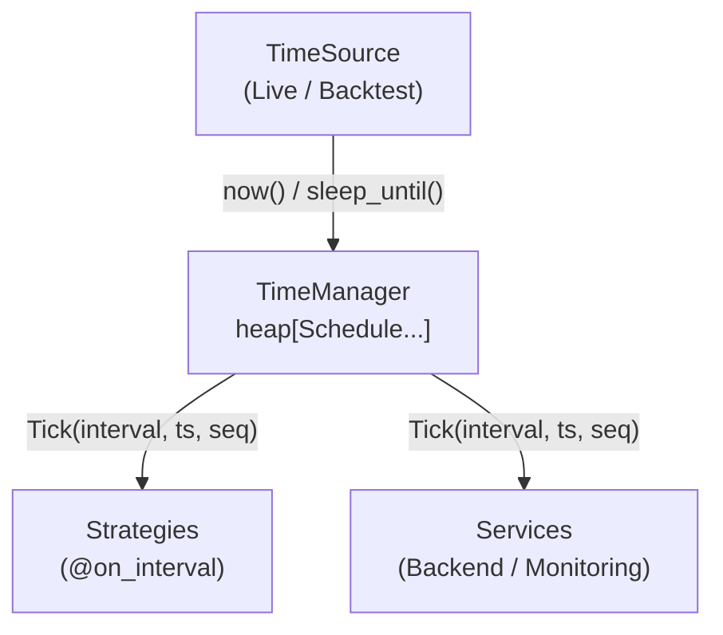

在这套设计里，`BacktestTimeSource` 像一个万能的快进遥控器：

- `now()` 返回一个静态的 `self.current`——"虚拟现在"。
- `sleep_until(target)` 直接把 `self.current = target`，瞬间跳到未来。
- `needs_barrier()` 返回 `True`，确保所有 handler 完成后再推进时间。

这意味着：回测中的一分钟，可以在 1 毫秒内完成。数据不穿越、结果可复现、速度极快。

如果整个系统里只有"查数据 → 算指标 → 做决策 → 下单"这些毫秒级操作，这套是没问题的。

但在 2025 年，我们在交易系统里引入了 LLM（大语言模型）。一个由 LLM 驱动的 Trigger，执行一次 `check → action` 的链路，可能需要 3~5 分钟真实时间：它要调用 API、等待推理、解析返回、可能还要自我修复一次失败的函数调用。

这 3 分钟，是真实世界里实打实流过去的时间。

问题来了：在这 3 分钟里，虚拟时间怎么办？

---

## 时间冻结：一个我们没预料到的"时空裂缝"

答案是：在旧设计里，虚拟时间完全冻结了。

让我们追踪一次完整的执行链路：

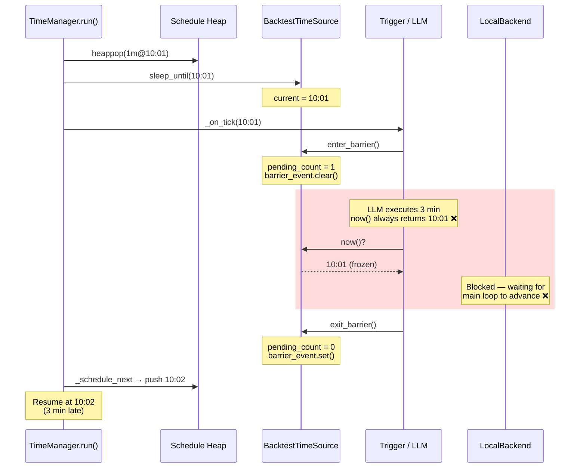

注意中间那 3 分钟发生了什么：**什么都没有。**

- `now()` 一直返回 `10:01`——因为 `self.current` 没有变。
- LLM 去查最新 K 线？对不起，你能看到的最新数据永远停在 10:00。
- 想下一个限价单？时间戳会被标记为 10:01，实际上此刻真实世界已经是 10:04。
- `LocalBackend._on_1m_tick` 本该在 10:02、10:03 被执行？它注册在 1m interval 上，但主循环卡在 `_execute_schedules` 里面，根本不会去 pop 下一个 schedule。

旧设计的状态机极其简单——只有两个状态：

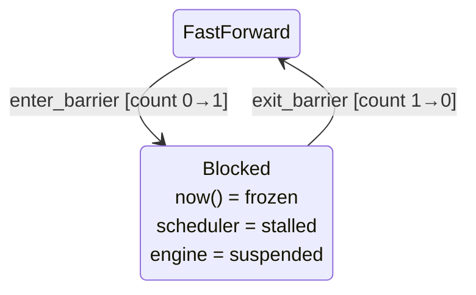

三个核心问题全部指向同一个根因：

| 问题                      | 表现                                      | 根因                                    |
| ------------------------- | ----------------------------------------- | --------------------------------------- |
| **P1: 时间冻结**          | LLM 看不到新 K 线，开仓时间戳停在过去     | `now()` 返回静态 `self.current`         |
| **P2: 交易引擎停摆**      | 限价单不撮合、止损止盈不触发              | 主循环阻塞，`_schedule_next()` 没被调用 |
| **P3: 1m trigger 不响应** | 新的 1m 事件被延迟到 barrier 释放后才追赶 | 堆中只有 1 个 schedule，无法 pop        |

这就像是一台 DVD 播放器：你可以快进，也可以正常播放，但当你按下暂停键的时候，整个宇宙都凝固了——角色不会老，天气不会变，剧情不会推进。

而我们需要的，是一种既能快进又能"真实流逝"的混合模式。

---

## 第一个念头：在 barrier 期间开一个后台 "Pump"

既然主循环被堵死了，最直觉的想法是：在 barrier 生效期间，开一个后台协程来持续扫描调度堆、执行到期的 handler。

这就是我们最初的 **Pump 方案**（v1）：

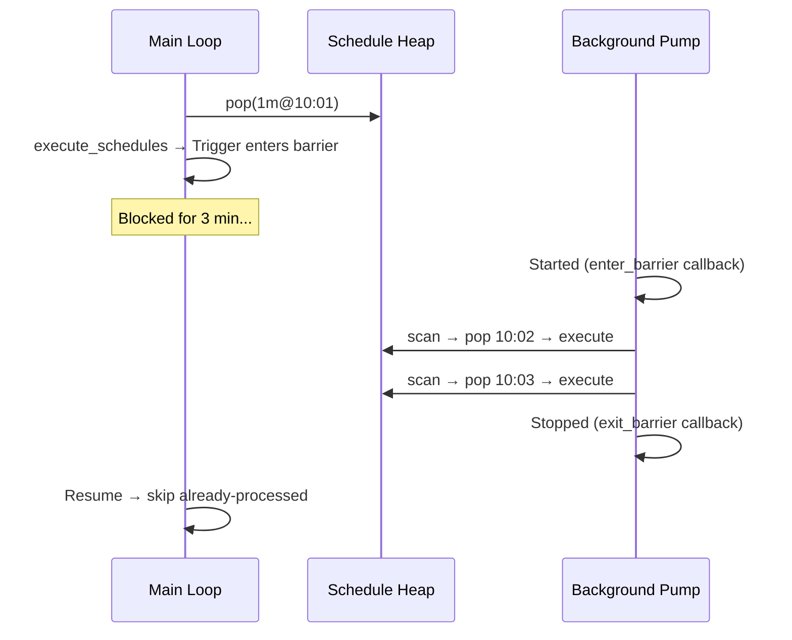

我们写出了完整的设计文档，包括 `_run_pump()`、`set_realtime_callbacks()`、`_pump_processed` 去重集合等一系列代码。

但当我们认真审计这个方案时，发现了三个致命问题。

### 致命问题 1：Pump 根本拿不到未来的 tick

当前调度模型是 `pop → execute → _schedule_next`，**每个 interval 在堆中只保留一个 schedule**。主循环 pop 之后、`_schedule_next` 之前，堆中该 interval 为空。

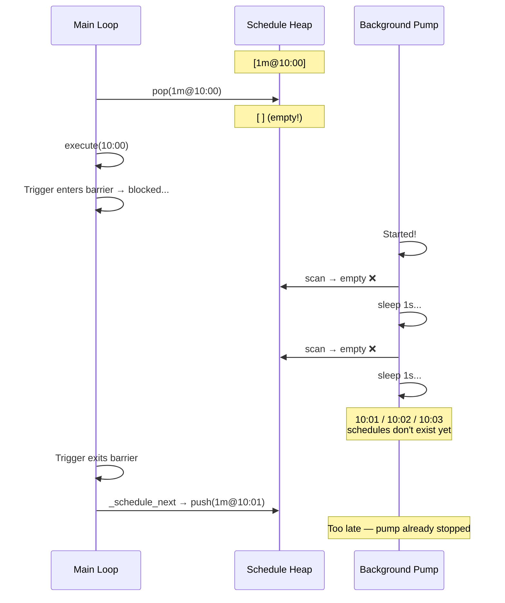

**Pump 从堆里根本找不到 10:01、10:02、10:03 的 schedule——因为它们还没被创建。**

### 致命问题 2：双执行体竞争堆所有权

即使我们想办法让 Pump 能看到 schedule（比如提前 reschedule），新的问题马上浮现：

- Pump 和主循环同时 pop/push 同一个堆 → 需要锁
- `_pump_processed` 去重集合无法覆盖所有边界情况
- 两个执行体各自 reschedule → 可能产生重复 schedule

这不是加几把锁就能解决的问题。这是**架构层面的所有权混乱**。

### 致命问题 3：时间语义分裂

如果 Pump 确实执行了 10:01 的 tick handler，`LocalBackend._on_1m_tick` 会怎么取价格？

```python
async def _on_1m_tick(self, _tick=None):
    timestamp = self._tm.now()      # ← 用的是动态时间，比如 10:03:17
    price = await self._load_price_snapshot(symbols, timestamp)
```

它用的不是 tick 的时间戳 `10:01`，而是 `tm.now()` 返回的当前动态时间 `10:03:17`。同一个"10:01 tick"的壳子里，装的是 10:03 的价格数据。

这既不是 replay（逐分钟回放），也不是 coalesce（合并到最新）——是一个**未定义的中间态**。

### 结论：Pump 方案被否决

经过审计，我们对 Pump 方案做出了明确的判断：

> Phase 1: now() 时间流动 — ⚠️ 基本可行，需补 pause accounting  
> Phase 2: Pump 设计 — ❌ 设计前提不成立

这是一次很好的教训：**看起来最直觉的方案，往往在细节上最先塌方。** 在并发系统中，引入第二个执行体（pump）来和第一个（主循环）共享可变状态（堆），几乎必然带来难以收拾的竞态问题。

---

## 退后一步：到底需要什么？

在推翻 Pump 方案之后，我们重新回到原点思考：

> LLM 执行期间，系统真正需要发生什么？

考虑一个实际场景：回测到 10:01，Trigger 开始执行 LLM 调用。3 分钟后（真实时间 10:04），LLM 返回了结果。

在这 3 分钟里：

1. **LLM 本身需要能看到新数据** → `now()` 必须推进。如果 LLM 在 10:03 查询 K 线，它应该能拿到 10:02 的最新数据。

2. **开仓/关仓的时间戳要准确** → 如果 LLM 在 10:03 下单，时间戳不该是 10:01。

3. **交易引擎需要恢复** → 但不一定需要**立即**恢复。等 LLM 完成后，补跑一次最新状态就够了。

第 3 点是关键的认知转变。我们之前假设"交易引擎必须实时运行"，但仔细想想：

- 回测里那 3 分钟的"missed ticks"（10:02、10:03）本身就是**虚构**的——真实回测本不该为 LLM 执行消耗虚拟时间
- 逐分钟 replay 这些 tick，用的还是当前时间的价格数据，语义上也是错的
- 真正合理的做法是：**等 LLM 做完决策，然后用最新的市场状态做一次"对账"**

这就引出了我们最终采用的方案：**Coalesce-to-Latest（合并到最新）**。

---

## 新设计：三态引擎——FastForward、Realtime、CatchUp

Pump 方案试图在 barrier 期间**主动补跑**。Coalesce 方案则选择了一条更聪明的路：**在 barrier 期间让时间自然流动，barrier 结束后被动追赶并合并**。

### 新的状态机

```mermaid
graph LR
    Start(("●")) --> FF["<b>FastForward</b><br/>now() = static current"]
    FF -- "enter_barrier [count 0→1]<br/>anchor time" --> RT["<b>Realtime</b><br/>now() = anchor + elapsed - paused"]
    RT -- "enter/exit_barrier [N>0]" --> RT
    RT -- "exit_barrier [count 1→0]<br/>fix current" --> CU["<b>CatchUp</b><br/>batch pop overdue<br/>coalesce by interval"]
    CU -- "catchup done" --> FF

    style Start fill:#000,stroke:#000
    style FF fill:#e1f5fe,stroke:#01579b
    style RT fill:#fff9c4,stroke:#fbc02d
    style CU fill:#e8f5e9,stroke:#2e7d32
```

三个状态，各司其职：

| 状态            | 什么时候           | `now()` 行为             | 主循环           | 交易引擎           |
| --------------- | ------------------ | ------------------------ | ---------------- | ------------------ |
| **FastForward** | 正常回测           | 返回静态 `current`       | 瞬间跳跃         | 每个 tick 精确执行 |
| **Realtime**    | Trigger 在执行 LLM | 返回 `anchor + 真实流逝` | 阻塞等待         | 暂停               |
| **CatchUp**     | LLM 执行完毕       | 返回固定 `current`       | 批量追赶 overdue | 用最新数据补跑一次 |

### 一次完整的执行时序

让我们把三个状态串起来，看一次完整的 LLM 执行是怎么走的：

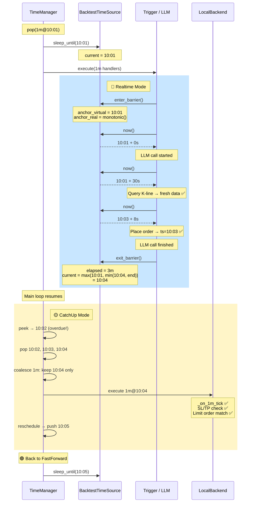

对比旧设计一目了然：

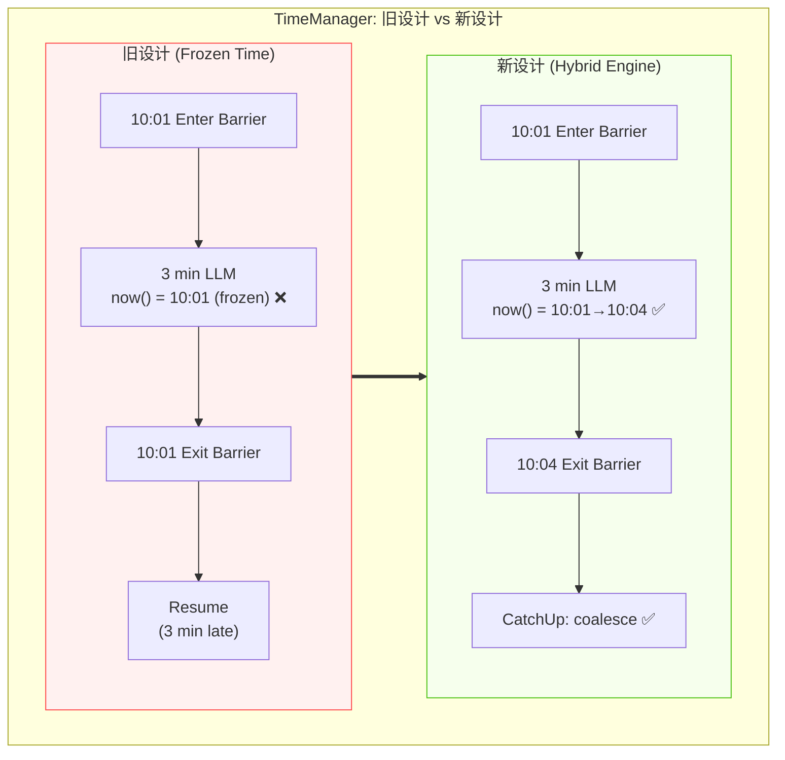

---

## Phase 1 深入：让 `now()` "活"起来

整个方案分两个阶段实施。Phase 1 只改 `BacktestTimeSource` 的核心方法，**上层 TimeManager / Trigger / Strategy / Episode 零改动**。

### 核心思想：时间锚点 + 真实流逝

进入 Realtime 模式时，记下两个"锚点"：

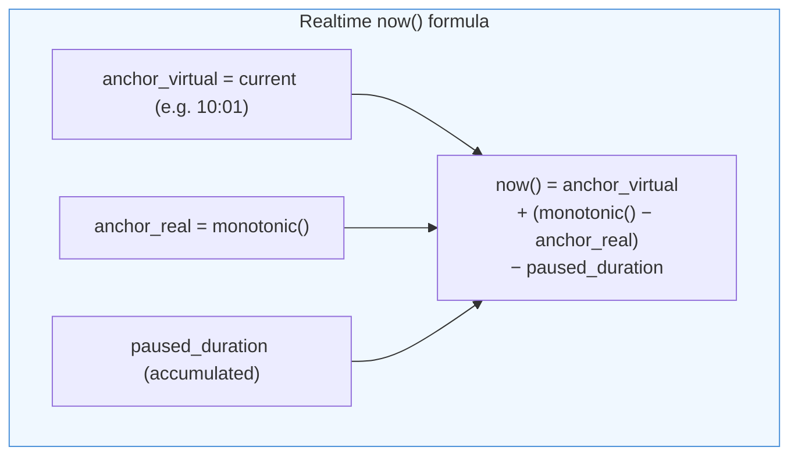

这个公式极其简洁，但蕴含了几个重要的设计决策：

**1. 使用 `time.monotonic()` 而非 `time.time()`**

`monotonic()` 是单调递增的，不受系统时钟调整（NTP 同步、手动改时间）影响。在需要测量"经过了多久"的场景下，它是唯一正确的选择。

**2. 多 Trigger 共享同一个锚点**

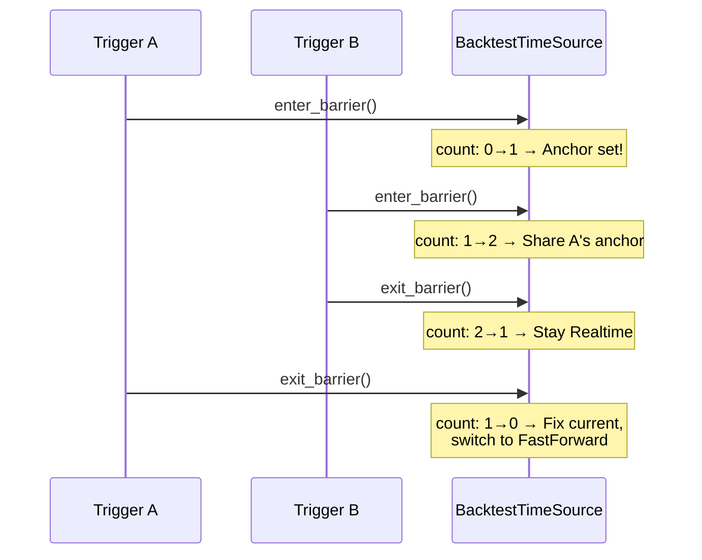

只有**第一个**进入 barrier 的 Trigger 会锚定时间，后续进入的都共享同一个锚点。这保证了即使多个 Trigger 并发执行，它们看到的 `now()` 也是一致的——都从同一个起点开始计算。

**3. `current` 永远不回退**

```python
self.current = max(self.current, min(advanced, self.end))
#              ^^^                          ^^^
#              不回退                       不超过 end
```

这个 `max + min` 的"夹击"确保了两个边界条件：

- `max` 保证单调递增——即使出现某种异常，时间也不会倒流
- `min` 保证不超过回测终点——否则 `is_finished()` 的语义会被打破

### Pause Accounting：你以为暂停了，时间真的暂停了吗？

在审计 Phase 1 设计时，我们发现了一个很容易被忽略的问题：

> 如果用户在 LLM 执行期间按了暂停键呢？

`time.monotonic()` 不知道什么是"暂停"。用户按暂停，真实世界里 30 秒过去了——但这 30 秒不该被算进虚拟时间。

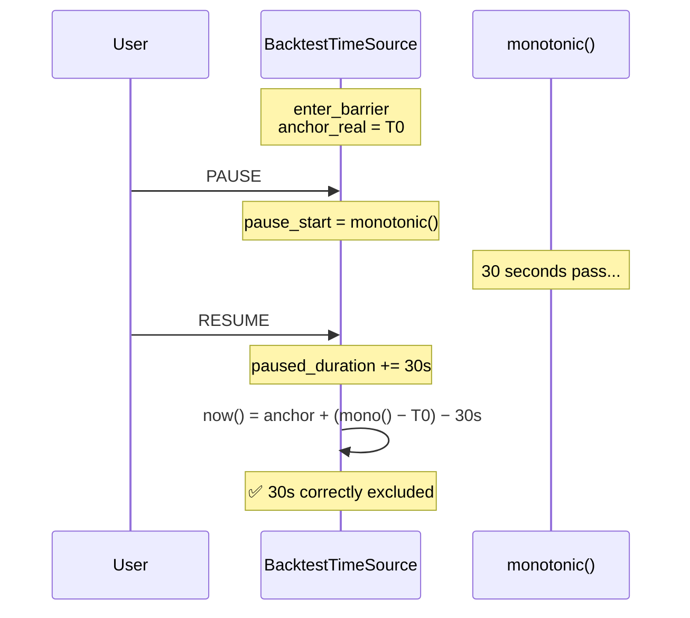

解决方案是引入 **pause 时长会计**（pause accounting）——精确记录暂停时长，并从 `now()` 的计算中扣除。

这个设计有一个精妙之处：**pause 回调是由 `TradeApp` 显式调用的**，而不是在 `now()` 中每次检查 `pause_event.is_set()`。

为什么？因为 `now()` 是热路径——每次 LLM 查询数据、每次下单、每次日志记录都会调用。在热路径上做 Event 查询和锁竞争是不明智的。相反，pause/resume 是低频操作（用户手动触发），在低频路径上做一次回调，成本可以忽略不计。

---

## Phase 2 深入：CatchUp 与 Coalesce 的优雅

Phase 1 让 `now()` 在 barrier 期间不再冻结。但 P2（交易引擎停摆）和 P3（1m trigger 不响应）还没解决——因为主循环还是被阻塞的。

Phase 2 的策略是：**不在 barrier 期间做什么，而是在 barrier 结束后做一次高效的"追赶"**。

### 追赶算法：Coalesce-to-Latest

当主循环恢复时，它发现堆顶的 schedule 已经过期了（比如堆顶是 10:02，但 `current` 已经是 10:04）。此时进入 CatchUp 模式：

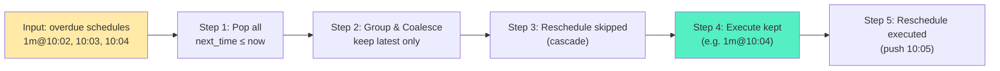

### 为什么不逐个 Replay？

| 维度       | Replay                          | Coalesce              |
| ---------- | ------------------------------- | --------------------- |
| 执行次数   | 3 次 (10:02→10:03→10:04)        | 1 次 (10:04)          |
| 取价时间   | 全用 `tm.now()` = 10:04         | `tm.now()` = 10:04    |
| 实际差异   | 跑了 3 次相同数据的代码         | 跑了 1 次             |
| 语义       | "假装"逐分钟回放                | 明确用最新状态"对账"  |
| 改动范围   | 堆结构 + Backend + Data 层      | 仅 TimeManager 小修改 |
| 数据正确性 | 伪 replay（时间戳 vs 数据矛盾） | 真 coalesce（一致）   |

Replay 的核心矛盾在于：你**号称**在回放 10:02 的 tick，但 `LocalBackend._on_1m_tick` 实际用 `tm.now()` 拿到的是 10:04 的价格。这不是 replay，这是穿着 replay 外衣的 coalesce——还不如直接 coalesce 来得干净诚实。

更重要的是哲学层面的问题：barrier 期间错过的这些 tick，到底是真实"应该逐个被看见"的事件，还是因为一次长耗时决策造成的调度空窗？如果我们强行 replay，很容易把"策略思考耗时"伪装成"市场真的给了你 3 次独立决策机会"。这反而不真实。

这非常像真实交易里的情况——你花了 3 分钟思考，世界不会礼貌地把这 3 分钟暂停给你。等你回过神来，面对的是"当前盘口"和"当前 K 线"，而不是一个按录像带逐帧回放的市场。

### `_last_schedule_time`：防止动态时间污染调度边界

Phase 2 还解决了一个更隐蔽的问题。

旧设计里有一个 `_current_time` 字段，同时承担了两种完全不同的角色：

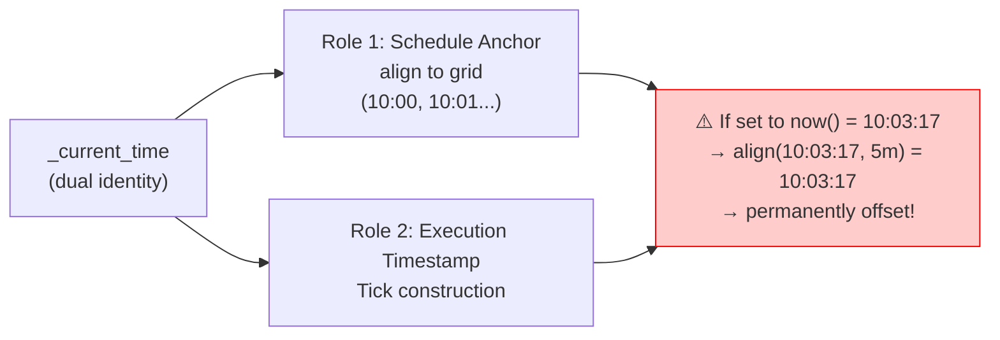

解决方案：将 `_current_time` 拆分，新增 `_last_schedule_time`，**只在主循环执行时用边界对齐的 `target_time` 更新它**：

```python
# 主循环正常路径
self._last_schedule_time = target_time  # 10:01, 10:02... 永远对齐

# CatchUp 路径
self._last_schedule_time = max(s.next_time for s in to_execute)  # 也是对齐的
```

永远不把 `now()` 的动态值（带秒数的）赋给这个字段。这保证了无论何时动态注册 handler，它的首触发都会落在 K 线边界上。

可以把新设计理解成两层时间：

| 字段                  | 语义             | 可能的值                          |
| --------------------- | ---------------- | --------------------------------- |
| `now()`               | 当前观察时间     | Realtime 期间动态递增（10:03:17） |
| `_last_schedule_time` | 当前调度边界时间 | 永远是网格点（10:03:00）          |

这是一次很典型的工程收敛：不是多加一个字段，而是把原来混在一起的两种语义彻底拆开。

---

## 从 v1 到 v2：一次方案演进的完整复盘

让我们站在更高的视角，回顾整个方案的演进过程：

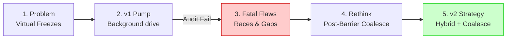

v1 和 v2 的核心差异，可以用一句话概括：

> **v1 试图在 barrier 期间主动做事（pump），v2 选择在 barrier 结束后被动追赶（coalesce）。**

| 维度       | v1 Pump                                      | v2 Coalesce                              |
| ---------- | -------------------------------------------- | ---------------------------------------- |
| 核心机制   | 后台协程持续扫描堆                           | 单线程主循环，barrier 后追赶             |
| 并发安全   | pump + 主循环竞争堆                          | 单一执行体，零竞态                       |
| 时间语义   | 未定义（replay vs coalesce 混合）            | 明确 coalesce-to-latest                  |
| 改动范围   | BacktestTimeSource + TimeManager + callbacks | BacktestTimeSource + TimeManager（更小） |
| 数据正确性 | pump 的 tick 用 `now()` 取数 ≠ tick 时间     | CatchUp 用最新 current，语义一致         |
| 调度主权   | 两个执行体竞争堆所有权                       | 主循环独占，不变量完整                   |

---

## 整体架构：升级后的 TimeManager 全景

让我们把所有组件放在一起，画一张完整的架构图：

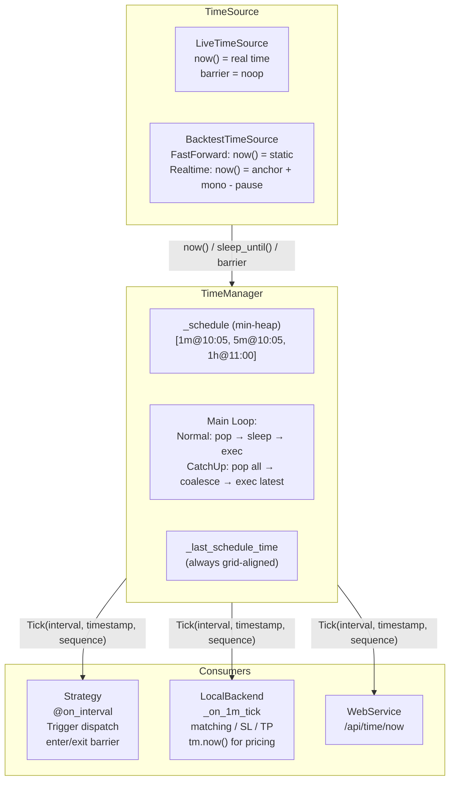

### 关键数据流

```mermaid
graph LR
    subgraph FF["1. FastForward"]
        FF1["sleep_until(10:01)"] --> FF2["current=10:01"] --> FF3["execute handlers"]
    end

    FF3 --> RT1

    subgraph RT["2. Realtime (LLM)"]
        RT1["enter_barrier()"] --> RT2["now() = 10:01 + elapsed"] --> RT3["exit_barrier() (10:04)"]
    end

    RT3 --> CU1

    subgraph CU["3. CatchUp"]
        CU1["pop overdue"] --> CU2["coalesce: keep 10:04"] --> CU3["execute handlers"]
    end

    CU3 --> Next["Next Cycle (10:05)"]

    style FF fill:#e3f2fd,stroke:#2196f3
    style RT fill:#fff3e0,stroke:#ff9800
    style CU fill:#e8f5e9,stroke:#4caf50
```

---

## 风险与缓解：为什么对这个方案有信心

任何架构变更都需要问一个问题："它会不会把事情搞得更糟？"

| 风险                      | 严重度 | 缓解措施                                                |
| ------------------------- | ------ | ------------------------------------------------------- |
| CatchUp 跳过了"重要" tick | 🟡      | 只跳过同 interval 的中间 tick；最终执行的一次用最新价格 |
| current 回退              | 🔴      | exit_barrier 使用 `max(current, adv)`                   |
| 超过 end 时间             | 🟡      | `now()` 和 exit 均 `min(candidate, end)`                |
| 动态注册对齐偏移          | 🔴      | `_last_schedule_time` 永远用边界时间                    |
| pause 期间时间多走        | 🟡      | pause accounting 精确扣除 pause 时长                    |
| Live 模式受影响           | ✅      | `needs_barrier()` = False，不触发任何新逻辑             |

最后一行值得特别强调：**整个改动在 Live 模式下完全不生效**。`LiveTimeSource.needs_barrier()` 返回 `False`，`enter_barrier()` / `exit_barrier()` 是 no-op，`now()` 就是 `datetime.now()`。新增的所有代码路径——Realtime 锚点、pause accounting、CatchUp coalesce——只在回测模式下激活。

这是一个很重要的安全边界：我们在回测引擎上做手术，实盘引擎完全隔离。

---

## 变更范围：极小的改动，极大的效果

让我们看看实际需要改多少代码：

**Phase 1: BacktestTimeSource 改动 (~50 行)**

| 项目     | 内容                                                         |
| -------- | ------------------------------------------------------------ |
| 新增字段 | `_anchor_virtual`, `_anchor_real`, `_paused_duration`, `_pause_start` |
| 重写方法 | `now()`, `enter_barrier()`, `exit_barrier()`                 |
| 新增方法 | `on_pause()`, `on_resume()`                                  |

**Phase 2: TimeManager 改动 (~60 行)**

| 项目     | 内容                                    |
| -------- | --------------------------------------- |
| 重命名   | `_current_time` → `_last_schedule_time` |
| 新增方法 | `_catchup()`                            |
| 主循环   | 新增 CatchUp 分支（overdue 检测）       |

**适配层 (~2 行)**

| 项目     | 内容                                                   |
| -------- | ------------------------------------------------------ |
| `app.py` | pause toggle 时调用 `ts.on_pause()` / `ts.on_resume()` |

总共大约 **110 行新增/修改**的代码。

不需要修改的文件列表反而更长也更有意义：

- `Trigger` — 已正确使用 `enter_barrier()/exit_barrier()`，无需任何改动
- `Strategy / Episode` — 只通过 `get_time_manager().now()` 获取时间，自动获益
- `LocalBackend` — `_on_1m_tick` 注册在 1m interval 上，CatchUp 会自动驱动
- `DataService` — 时间来自 `tm.now()`，Realtime 期间自动拿到新数据

这就是好的抽象层设计带来的红利：**在底层做了一次精确的手术，所有上层消费者自动获益，无需逐一修改。**

> 内核层吸收复杂度，业务层不被连带污染。

---

## 收尾：从 TimeManager 的演进中学到的

回顾整个过程，如果把这轮演进压缩成 5 个关键词：

1. **Unified Clock**：系统仍然坚持只有一个时间内核。这条底线没有变。

2. **Runtime Switching**：新的能力不是新建第二套时间系统，而是在 backtest 时钟内部做运行时切换。

3. **Pause Accounting**：一旦时间开始流动，暂停就必须成为一等语义，而不是"顺便停一下 UI"。

4. **Semantic Separation**：`now()` 和 `_last_schedule_time` 代表不同语义，必须拆开。

5. **CatchUp over Replay**：面对 barrier 期间的 overdue ticks，选择面向最新状态对账，而不是机械 replay。

---

这五个关键词背后，是三个更深的教训：

**教训一：最直觉的方案往往最危险。** Pump 方案看起来合理得不能再合理：主循环阻塞了？开个后台协程来补位！但它引入了双执行体竞争、堆所有权分裂、时间语义未定义等一系列问题。在并发系统中，"多加一个执行体"几乎永远不是最优解。

**教训二：搞清楚"需求的本质"比"实现的细节"重要得多。** 从"我们需要在 barrier 期间驱动交易引擎"到"我们需要在 barrier 结束后用最新状态补跑一次"，这个认知转变才是 v2 方案诞生的关键。

**教训三：好的抽象是最强的杠杆。** 整个 TimeManager 体系——`TimeSource` 接口、`needs_barrier()` 布尔选择、`Tick` + `Schedule` 数据结构——在一年前设计的时候，完全没有预见到"LLM 执行 3 分钟"这种场景。但正是因为当初把概念分离得足够清楚，现在我们才能只改约 110 行代码，就解决了一个看起来很复杂